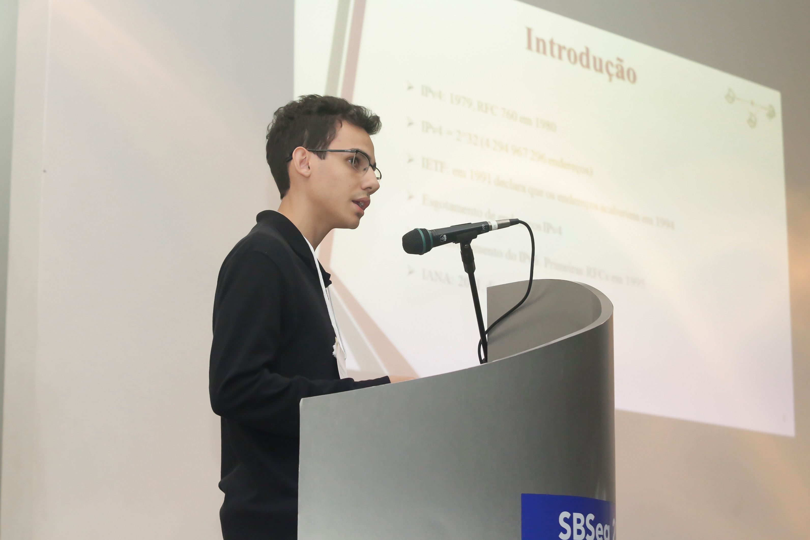
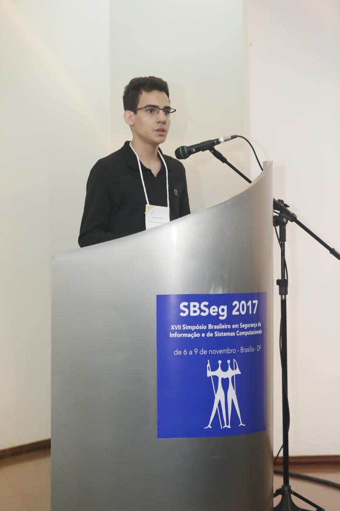
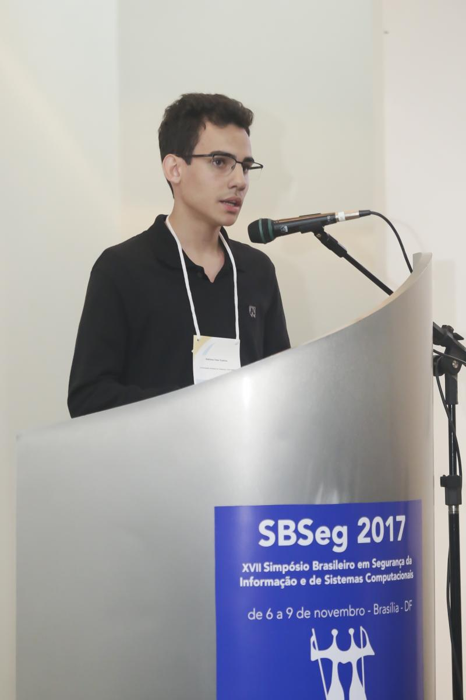
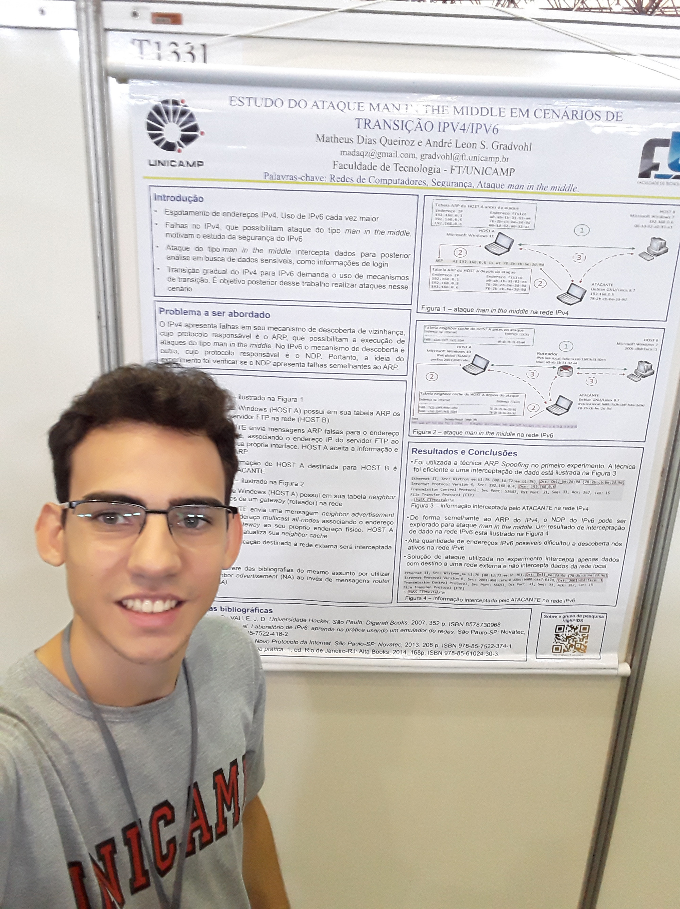
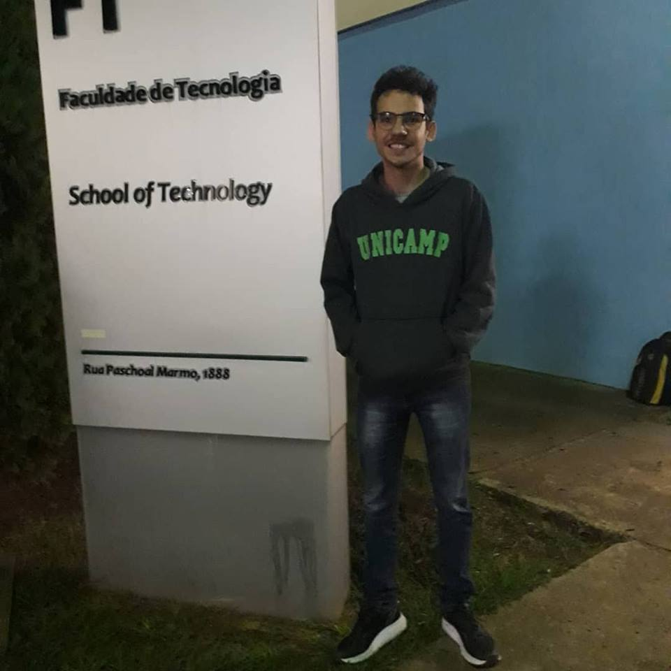
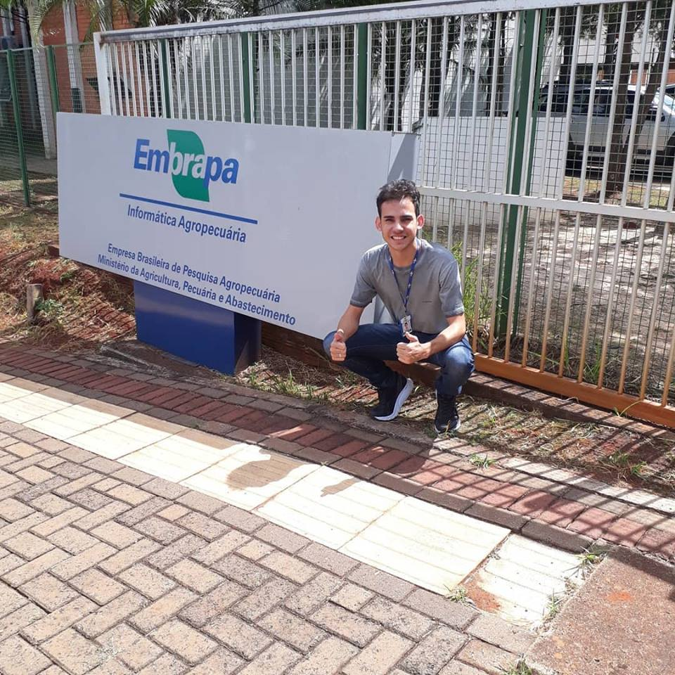

# Sobre o Matheus

# Resumo

Aos 13 anos me descobri na tecnologia ao cursar Hardware e Redes e prestar o primeiro suporte a computador para um cliente. Desde então, sou fascinado por Linux, Redes e Segurança. 

Entusiasta em IoT, apresentei meu TCC para o curso técnico de mecatrônica utilizando Arduino, e isso me rendeu o cargo de professor de programação durante um ano (2013) na escola onde estudava. 

Na faculdade (TADS FT UNICAMP), ao trabalhar em uma iniciação científica, publiquei um artigo sobre segurança em redes no SBSeg 2017 e um resumo no Congresso de IC da UNICAMP. Então, me encantei pela produção de conteúdo e desenvolvi as habilidades de pesquisa, estudo e aprendizagem. 

Tive uma experiência privilegiada de estágio. Trabalhei com profissionais exemplares, aprendi processos maduros e participei da contínua melhoria dos mesmos. Pude conhecer melhor a área de Governança de T.I e tive contato direto com uma infraestrutura grande, complexa e muito bem gerenciada, toda open source. Foi marcante!

Acredito que a informação aberta e o compartilhamento do conhecimento tem o potencial para produzir grandes inovações e soluções.

Hoje, atuo como administrador de sistemas na HST, trabalhando com as tecnologias que eu sempre gostei e admirei.

# Link para visualizar artigo publicado no SBSeg 2017:

<http://doi.org/10.5281/zenodo.1039050>

# Link para visualizar resumo publicado pelo XXV Congresso de Iniciação Científica da UNICAMP:

<http://dx.doi.org/10.19146/pibic-2017-77893>

# Redes sociais para contato

<https://www.linkedin.com/in/matheus-dias-queiroz/>

# Galeria

