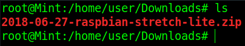
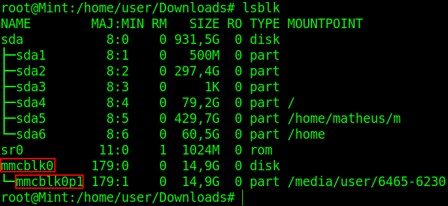
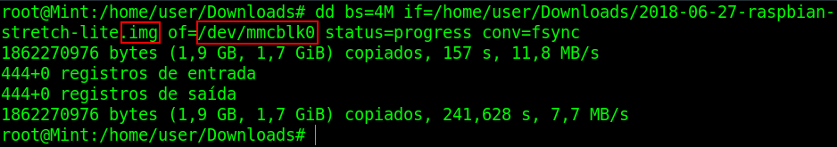
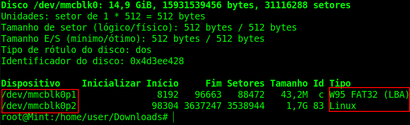

<!--more-->

# Nesta parte teremos:

* Instalação do Raspbian Lite em um cartão SD.

# O que será necessário:


* Um cartão de memória Micro SD (podendo ser dos tipos SD, SDHC e SDXC) compatível* com Raspberry Pi 3 Model B de no mínimo 4GB, mas eurecomendo ao menos 16GB, o que dá mais folga para a instalação de ferramentas e serviços;
* Um computador com alguma distro Linux instalada, de preferência baseada em Debian que foi a distro a utilizada durante o Projeto;
* Uma maneira de inserir o cartão de memória do tipo Micro em seu computador. Há adaptadores para isso, por exemplo, USB.



Sobre a compatibilidade do cartão Micro SD, segue link com uma extensa lista de marcas e modelos que já se conhece se são compatíveis ou não. <https://elinux.org/RPi_SD_cards#Working_.2F_Non-working_SD_cards>.


Para mais informações e também para entender melhor a relação Cartão SD e Raspberry Pi, acesse os links <https://www.raspberrypi.org/documentation/installation/sd-cards.md> e <https://elinux.org/RPi_SD_cards>. 

# Contextualização

A versão do Raspbian utilizada no projeto e também a atual no momento é o Raspbian Stretch Lite. Além do Raspbian ser baseado no Debian, ele também utiliza os nomes das versões do Debian, e daí vem o “Stretch” no nome


A versão do Raspbian utilizada no projeto e também a atual no momento é o Raspbian Stretch Lite. Além do Raspbian ser baseado no Debian, ele também utiliza os nomes das versões do Debian, e daí vem o “Stretch” no nome


## Por que Raspbian Lite?
Como o objetivo do projeto é utilizar o Raspberry para fornecer e gerir alguns serviços de rede, não será necessário utilizá-lo como um Desktop, que possui ambiente gráfico com ferramentas como calculadora, navegador de internet, reprodutor de mídias, etc. Pelo contrário, precisamos utilizar um sistema que consuma o menos de memória RAM e processador possível, para que o poder computacional fique o máximo disponível para os serviços implementados. Como o próprio raspberrypi.org descreve, o Raspbian Lite é “Minimal image”, ou seja, um sistema operacional com o mínimo necessário para funcionar, e a partir disso instalamos e personalizamos para a nossa necessidade. Logo, um sistema ideal para o projeto.


O Raspbian também possui uma versão Desktop, com ambiente gráfico e as devidas ferramentas básicas para esse ambiente.


Chega de papo, mãos ao teclado!

# Instalação do Raspbian Lite no Raspberry PI a partir do Linux

Os passos de instalação do Raspbian a seguir se baseou no link <https://www.raspberrypi.org/documentation/installation/installing-images/linux.md>, onde é dado um passo a passo mais avançado devido ao uso de ferramentas via terminal a partir de um sistema Linux.

Se você não tem muita familiaridade com comandos via terminal, indico o link <https://www.raspberrypi.org/documentation/installation/installing-images/README.md> onde é instruído o uso de uma ferramenta gráfica, que pode ser usada dos sistemas Windows, Mac OS e Linux, para a gravação do sistema em um cartão SD.

Será necessário um cartão de memória Micro SD de no mínimo 4GB e livre para a instalação e uso do sistema. O cartão não poderá ser utilizado para outro fim e os dados que estiverem no cartão serão apagados. Cuidado!

Quais os passos:

 1. Download do sistema Raspbian Lite
 1. Descompactação do arquivo baixado
 1. Identificação e preparação do cartão de memória
 1. Gravação do sistema no cartão de memória

# 1. Download do sistema Raspbian Lite

Para começar, faça o Download da última versão do sistema Raspbian Lite no link: <https://www.raspberrypi.org/downloads/raspbian/>


No caso do projeto foi escolhido o Download do ZIP.


No meu caso foi utilizado um cartão de memória SanDisk Micro SDHC 1 Classe 4 de 16GB. Particularmente, não foi minha prioridade escolher um bom cartão de memória, com boa velocidade e etc, pois a minha real intenção era rodar o sistema em um HD Externo, coisa que aconteceu e que vou abordar nas próximas partes do Projeto. Se você leitor, tem o intuito de deixar o sistema rodando em um cartão de memória, recomendo que preocupe-se com o limitado ciclo de leituras e escritas que uma cartão de memória pode realizar. Ou seja, se esse limite for atingido enquanto o sistema estiver funcionando, provavelmente ele parará de funcionar e os dados armazenados poderão ser perdidos. Por isso, recomende que pesquise sobre o assunto. A seguir um link de uma discussão interessante sobre este assunto:

<https://pt.stackoverflow.com/questions/8990/qual-é-a-vida-útil-de-um-cartão-sd-com-raspbian-raspberry-pi>

Vamos voltar ao que interessa…

Depois de baixar a imagem do sistema operacional Raspbian Lite, teremos um arquivo (imagem do sistema Raspbian Lite) na pasta escolhida para receber o download, parecido com esse:



# 2. Descompactação do arquivo baixado
Logo, vamos descompactar esse arquivo
```shell
unzip 2018-06-27-raspbian-stretch-lite.zip
```
 do sistema Raspbian")

Pronto! Já temos o sistema pronto para ser gravado no cartão de memória. Agora, vamos preparar o cartão para receber o sistema. 

# 3. Identificação e preparação do cartão de memória

Nesse momento, insira o cartão em seu computador.

Quando um cartão de memória ou pendrive, por exemplo, é inserido no computador, o Linux os reconhece como um dispositivo e todo dispositivo tem um nome. Para descobrir o nome do dispositivo no qual o cartão de memória foi reconhecido pelo Linux, dê o comando lsblk, como na imagem a seguir.  



O comando da imagem acima foi dado para identificarmos o cartão de memória no sistema Linux. Comumente, o Linux reconhece um cartão Micro SD como /dev/mmcblk. Observem ainda na imagem acima, que temos um “mmcblk0” (destacado em vermelho na imagem). Se houvessem mais cartões de memória inseridos no computador, estariam listados como “mmcblk1”, “mmcblk2” e assim por diante. O mmcblk0p1 que está ligado ao “mmcblk0” é uma partição daquele cartão de memória. Devemos nos certificar de desmontar TODAS as partições associadas ao cartão de memória que queremos instalar o sistema. No nosso caso, temos apenas a partição mmcblk0p1 (e geralmente costuma ser só uma mesmo). Para desmontá-la:

```shell
umount /dev/mmcblk0p1
```
# 4. Gravação do sistema no cartão de memória

Finalmente, daremos o comando para gravar o sistema no cartão de memória. Certificado de que o cartão de memória está desmontado, usaremos a ferramenta dd para gravar a imagem do sistema que descompactamos lá na pasta de Download para o cartão. No meu caso o comando ficou:

```shell
dd bs=4M if=/home/user/Downloads/2018-06-27-raspbian-stretch-lite.img of=/dev/mmcblk0 status=progress conv=fsync
```

O destino da gravação deve ser o nome do dispositivo e não da partição. O arquivo de imagem do sistema termina em .img e não .zip.





O parâmetro `bs=4M` significa que serão lidos e escritos 4MB por vez, `if=origem` / caminho completo da imagem do sistema a ser gravado, `of=destino` /  para onde a imagem vai ser gravada, `status=progress` para mostrar o progresso da gravação e `conv=fsync` indica que a gravação física dos dados (no cartão de memória) deve ser feita ainda dentro do processo do dd, e não somente começar quando o dd terminar seu processo. Esse comando come esses parâmetros são os recomendados pelo [raspberrypi.org](https://www.raspberrypi.org).


Terminado o processo como na imagem acima, o sistema Raspbian Lite está instalado no cartão de memória Micro SD. Para verificar o resultado da gravação, dê o comando fdisk -l. No dispositivo /dev/mmcblk0 deverá haver duas partições, sendo uma FAT32 e outra Linux (EXT4), como na imagem a seguir.

```shell
fdisk -l
```
