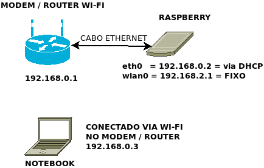
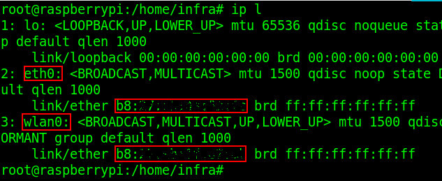

Inicialmente, meu objetivo final quando comecei este projeto era esta parte: a parte em que vamos implementar os serviços de ponto de acesso Wi-Fi e de servidor DHCP. Com esses dois serviços configurados e mais algumas configurações de rede e firewall, o Raspberry se torna capaz de substituir muito roteador residencial com propriedade. Reflita: terás um sistema Linux estável e totalmente configurável, com hardware superdimensionado quando comparado a de roteadores residenciais, gerenciando sua rede Wi-Fi e seu acesso a Internet. Acredito que, “robusto” é uma possível palavra de reação para o que acabamos de ler.

Além disso, haverá a possibilidade de estender as funções do Raspberry. “Preciso de VPN = instale o serviço”. “Meu videogame está com problema para acessar o servidor do jogo = nada que uma regrinha no iptables não resolva”. “Será útil compartilhar arquivos entre os computadores da minha residência = só configurar”. “Quero implementar um site (meu caso) = vá em frente”. As possibilidades são infinitas, ainda sem entrar no mérito das possíveis automações elétricas e eletrônicas que o Raspberry é capaz de fazer graças aos seus pinos programáveis.

Enfim, esta parte do projeto, depois de pronta, serviu de inspiração para eu continuar tendo ideias, realizar experimentos e, resumidamente, chegar ao nível de desenvolver um site. Espero que, depois de implementada, esta parte também sirva de inspiração para você continuar experimentando e aprendendo com o seu Rasp.

<!--more-->


# Conteúdo

# Nesta parte teremos:
- O que será necessário:
- Minha topologia de rede
1. Configuração das nomenclaturas das interfaces de rede
2. Configuração do arquivo interfaces
3. Instalação e configuração do serviço hostapd para fazer do Raspberry um ponto de acesso Wi-Fi
4. Instalação e configuração do serviço isc-dhcp-server
5. Compartilhamento da Internet e configuração de um script de regras para o Firewall iptables
- Fontes

# O que será necessário:

- Conectar o Raspberry na rede via cabo
- Acessar o Raspberry via SSH para configurá-lo

# Minha topologia de rede




# 1. Configuração das nomenclaturas das interfaces de rede

“Antigamente” o Linux estabelecia a nomenclatura de suas interfaces de rede de maneira sequencial. Para exemplificar, imagine o cenário de 2 placas Ethernets e 2 Wi-Fi instaladas no computador. Logo, teríamos as interfaces eth0, eth1, wlan0 e wlan1.

Os nomes (eth0, wlan0, etc) eram dados para as interfaces assim que fossem reconhecidas pelo kernel, e o problema desse mecanismo de reconhecimento das interfaces é que o mesmo não era previsível, podendo durante o processo de boot reconhecer primeiro a placa que antes do reboot era eth1, e então dar o nome de eth0 a ela. Aí, já viu, todas as configurações destinadas a uma placa iria para a outra e a confusão estaria feita.

O novo mecanismo para nomear as interfaces de rede considera, em sequência, políticas para dar nomes. A primeira informação/política que estiver disponível, é então usada para nomear a interface. Segue lista das políticas e possíveis nomes (placa ethernet) para cada uma:

* Nomes baseados na informação de Firmware/BIOS On-Board = eno1
* Nomes baseados na informação de Firmware/BIOS PCI Express = ens1
* Nomes baseados na informação de Localização Física do Hardware = enp2s0
* Nomes baseados na informação de Endereço Físico (MAC) = enx020b1c4d5ef6
* Nomes Clássicos Nativos do Kernel (Imprevisíveis) = eth0

Porém, muitos administradores são extremamente acostumados com os nomes comuns (eth0, wlan0) e preferem utilizá-los para suas configurações. Na minha opinião, configurar um nome próprio e fixo para as interfaces de rede facilita o trabalho de um administrador de rede. Portanto, iremos configurar nomes de interfaces de maneira que não mudem e que sempre se relacionem com a mesma placa de rede.

Primeiro, descubra os endereços MAC das placas de rede ethernet e Wi-Fi do Raspberry dando o comando

```Shell
ip l (alias para o comando ip link)
```

Para ficar mais claro onde localizar o endereço MAC de cada placa, observe os quadros vermelhos destacados na imagem a seguir. Eles relacionam uma interface (ex.: eth0) com seu respectivo endereço MAC, que está esmaecido na imagem.



Anote esses endereços MAC associando-os com suas respectivas placas (eth0/wlan0, por exemplo).

Com o editor de textos de sua preferência e como usuário root, crie o arquivo `/etc/udev/rules.d/10-network.rules`.

Nele, insira as seguintes linhas:

> `# INTERFACE ETHERNET`
> `SUBSYSTEM==”net”, ACTION==”add”, ATTR{address}==”endereçoMAC:aqui”, NAME=”eth0″`
>
> `# INTERFACE WI-FI`
> `SUBSYSTEM==”net”, ACTION==”add”, ATTR{address}==”endereçoMAC:aqui”, NAME=”wlan0″`

Dessa maneira o sistema é instruído, via endereço físico da placa (cada qual tem um único), nomeá-las com o nome que escolhemos no parâmetro NAME. No nosso caso, a placa ethernet do Raspberry **sempre** será **eth0** e a Wi-Fi sempre **wlan0**.

Se seu sistema já estava reconhecendo as interfaces de rede com esses nomes, não será necessário reiniciar. Caso não, reinicie o sistema para que as alterações tenham efeito e também para sejam testadas

Para mais informações sobre o mecanismo de nomenclaturas de interfaces de rede do Linux, segue a minha fonte: <http://labcisco.blogspot.com/2015/11/nova-nomenclatura-de-interfaces.html>

# 2. Configuração do arquivo interfaces

No arquivo ***interfaces***, iremos configurar um endereço estático (fixo) para a interface de rede Wi-Fi, e configurar a interface de rede ethernet para que receba endereço IP via dhcp, que virá do modem de internet.

Segue como ficou o meu arquivo `/etc/network/interfaces`:

```interfaces
# interfaces(5) file used by ifup(8) and ifdown(8)

# Please note that this file is written to be used with dhcpcd
# For static IP, consult /etc/dhcpcd.conf and ‘man dhcpcd.conf‘

# Include files from /etc/network/interfaces.d:
source-directory /etc/network/interfaces.

#-- INTERFACE LOOPBACK --#

auto lo
iface lo inet loopback

#-- FIM DA INTERFACE --#


#-- INTERFACE WI-FI --#

#- Configuração para hotspot wi-fi
auto wlan0
iface wlan0 inet static
    address 192.168.2.1
    netmask 255.255.255.0

#-- FIM DA INTERFACE --#


#-- INTERFACE ETHERNET --#

auto eth0
iface eth0 inet dhcp

#-- FIM DA INTERFACE --#

```

Na parte anterior deste projeto, eu expliquei boa parte dos parâmetros do arquivo interfaces. As novidades neste caso estão nos parâmetros static seguido de address e netmask, o que por si só já diz muito, são os parâmetros que definem uma configuração fixa de IP para a interface. Fique à vontade para definir o endereço IP que preferir.

 
Se na parte anterior parte 2 deste projeto você somente conectou o cabo e acabou não lendo as instruções de conexão Wi-Fi, recomendo que volte e dê uma lida, pois lá tem boas explicações sobre parâmetros e uso do arquivo interface.


3. Instalação e configuração do serviço hostapd para fazer do Raspberry um ponto de acesso Wi-Fi

hostapd é um serviço que implementa o Gerenciamento de Ponto de Acesso IEEE 802.11 (Wi-Fi), segurança Wi-Fi com autenticador IEEE 802.1X/WPA/WPA2/EAP, entre outros. Logo, ele fornece o necessário para que o Raspberry trabalhe como um ponto de acesso Wi-Fi e que clientes se conectem a ele.

Instale este serviço com o comando:

```Shell
aptitude install hostapd
```

Agora vamos criar o arquivo de configuração para o serviço do hostapd. Faça isso com editor de textos preferencial. No meu caso:

```Shell
nano /etc/hostapd/hostapd.conf
```

Colocarei aqui um arquivo de configuração de exemplo com comentários explicativos. Segue:

```hostapd.conf
# Este é o nome da interface WiFi que nós configuramos anteriormente
interface=wlan0

# Uso do driver nl80211
driver=nl80211

# Nome da rede Wi-Fi que será criada
ssid=Rasp

# Usar a faixa de frequência 2.4GHz
hw_mode=g

# Define o canal Wi-Fi de sua preferência. Prefira os canais 1 ou 6 ou 11.
channel=11

# Habilita o padrão 802.11n
ieee80211n=1

# Habilita WMM e suporte a QoS
wmm_enabled=1

# Aceita todos endereços MAC
macaddr_acl=0

# Usar autenticação WPA
auth_algs=1

# Exige que os clientes conheçam o nome da rede
ignore_broadcast_ssid=0

# Usar WPA2
wpa=2

# Usar chave pré-compartilhada
wpa_key_mgmt=WPA-PSK

# Senha para acessar a rede
wpa_passphrase=coloqueUmaSenhaForteAqui

# Usar AES invés de TKIP
rsn_pairwise=CCMP

# Para comando hostapd_cli all_sta funcionar, caso necessário
ctrl_interface=/var/run/hostapd
ctrl_interface_group=0
```

Falta instruir o serviço hostapd para que use este arquivo de configuração que acabamos de criar e parametrizar. Faça isso editando o arquivo `/etc/default/hostapd`, descomente a linha que contém (apenas retirando a cerquilha) `#DAEMON_CONF=””`, e entre aspas insira o arquivo que criamos. Ficará assim:

> `DAEMON_CONF=”/etc/hostapd/hostapd.conf”`

# 4. Instalação e configuração do serviço isc-dhcp-server

Para que nosso sistema Linux forneça endereço IP aos clientes que se conectarem na rede Wi-Fi do Raspberry, tornando-os capazes de se comunicar, devemos instalar e configurar um serviço de DHCP Server. Um tradicional e robusto serviço para esse meio é o **isc-dhcp-server**. Instale-o com:

```Shell
aptitude install isc-dhcp-server
```

Ao final da instalação pode aparecer umas mensagens de falhas e erros. Ignore-as. Está tudo bem, rsrs.

Antes de ir para principal arquivo de configuração do serviço, vamos configurar o arquivo `/etc/default/isc-dhcp-server` para que o isc-dhcp-server saiba em qual interface ele deverá trabalhar.

```Shell
nano /etc/default/isc-dhcp-server
```

Na linha `INTERFACESv4=””`, entre as aspas coloque a interface Wi-Fi, wlan0, ficando:

> `INTERFACESv4=”wlan0″`

E comente a linha `INTERFACESv6=””`, pois isso recomendado ao estar trabalhando somente com IPv4. Ficará:

> `INTERFACESv4=”wlan0″`
> 
> `#INTERFACESv6=””`

Justamente por não estarmos configurando IPv6, devemos renomear o arquivo `/etc/dhcp/dhcpd6.conf`. Para isso, dê o comando:

```Shell
mv /etc/dhcp/dhcpd6.conf /etc/dhcp/dhcpd6.conf.bak
```

Agora, como já feito anteriormente; por prevenção, copie o arquivo original de configuração com cp /etc/dhcp/dhcpd.conf /etc/dhcp/dhcpd.conf.bak. Para ficar mais fácil e claro, escreverei a seguir os únicos parâmetros que deverão ficar (“descomentados”) neste arquivo de configuração. Os demais, pode apagar ou comentar. Se quiser facilitar essa tarefa, apague o arquivo de configuração com rm /etc/dhcp/dhcpd.conf e crie o novamente com, por exemplo:

```Shell
nano /etc/dhcp/dhcpd.conf
```

Os parâmetros deverão ser:
```conf
default-lease-time 86400;
max-lease-time 604800;
db-time-format local;

ddns-update-style none;

authoritative;

subnet 192.168.2.0 netmask 255.255.255.0 {
  range 192.168.2.2 192.168.2.254;
  option routers 192.168.2.1;
  option broadcast-address 192.168.2.255;
  option domain-name-servers 1.1.1.1, 1.0.0.1;
}
```

 
Os servidores DNS definidos foram os da Cloudflare, 1.1.1.1 e 1.0.0.1. Caso prefira outro, como os do Google ou do seu provedor de internet, apenas substitua-os no arquivo no lugar do valores já citados do Cloudflare.


Para entender melhor os parâmetros de configuração do servidor DHCP, leia o manual `man dhcpd.conf`. Aliás, recomendo fortemente que se pesquise mais sobre possíveis configurações dessa ferramenta, pois aqui foi passado o básico do básico.