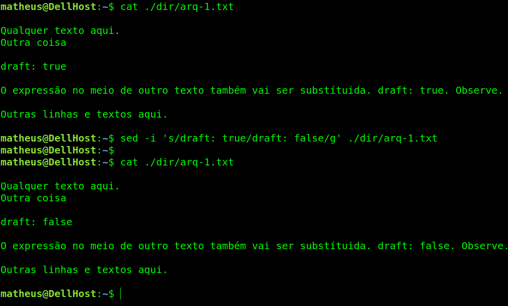
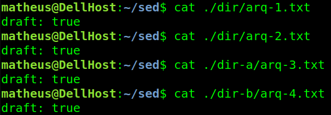
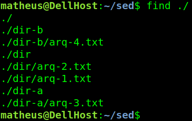
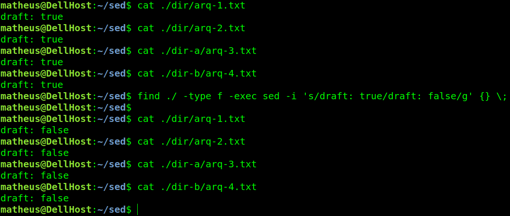

# Como usar o sed e o find para substituir texto dentro de um arquivo no linux


# Contextualização
Com certeza há diversas soluções para o problema de substituir um texto/expressão de dentro de um arquivo no Linux. A solução usada para este caso foi o uso dos comandos `sed` e `find`.

Eu tinha vários arquivos texto (.txt) dentro de um diretório no Linux e todos esses arquivos tinham a expressão `draft:true` dentro deles. Eu precisava mudar essa mesma expressão em todos os arquivos para `draft:false`. Uma das soluções possíveis: usar o comando `sed`.

# Comando sed para substituir uma expressão em um único arquivo

```Shell
sed -i 's/draft: true/draft: false/g' ./dir/arq-1.txt
```

   


A opção `-i` significa edição no local, ou seja, o sed vai editar/modificar o próprio arquivo passado como parâmetro. Sem esta opção, ao encontrar a expressão `draft: true` ele ia simplesmente imprimir `draft: false` na saída padrão do Linux (stdout), o Shell, e não ia alterar o arquivo ou substituir a expressão. Faça o teste. =D
Outro ponto é a sintaxe de quando queremos usar o `sed` para substituir algo: `sed -i 's/SubstituaIsso/PorIsso/g'`. A letra `s`, no começo, significa que queremos substituir algo; a `g` no final significa que queremos fazer uma substituição global, ou seja, que todas as ocorrências encontradas sejam substituídas - e não somente a primeira ocorrência, que é o comportamento padrão a ser executado caso o `g` não seja colocado.



# find + sed para substituir uma expressão em mais de um arquivo

O cenário é o seguinte:

     

Como usar o **sed** para subtituir uma mesma expressão em todos os arquivos de uma vez? 

## find

O comando find no linux procura por arquivos e diretórios. Por padrão faz uma busca recursiva! Entre as diversas e poderosas opções do find, existe a opção do próprio find executar comandos em seus resultados.

Para visualizar melhor essa opção, veja o resultado do comando `find ./`



Veja que foram listados todos os arquivos e pastas dentro de `./`.

Com a opção `-exec` é possível executar um comando em cada um desses arquivos e pastas que o find listou. Já dá para ligar os pontos, certo?

## find + sed

O comando para aplicar o comando `sed` em todos os arquivos de um diretório usando `find` fica: 

```Shell
find ./ -type f -exec sed -i 's/draft: true/draft: false/g' {} \;
```

Após aplicar o comando `find`, veja a repetição do comando cat nos arquivos:
    



`-type f` diz para o find buscar somente arquivos, assim ele não lista diretórios como resultado; `{}` é onde o find substitui por seus resultados, completando o comando (exemplo: `sed -i 's/draft: true/draft: false/g' **./dir/arq-1.txt** \;`); O fim do comando aplicado pelo find deve terminar em `\;` quando queremos executar o comando informado `-exec` para cada resultado do find, um por vez. Quando queremos executar o comando passado em `exec` usando todos os resultados como parâmetro de uma vez só, ao invés do `\;` usamos o `+`. 


