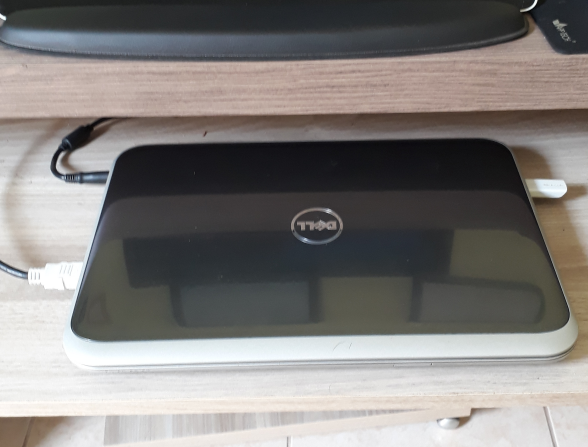

# Instalação do Adaptador Wi-Fi USB Alfa AWUS036NH no Linux e Experimento de Desempenho


Veja como instalar o adaptador Wi-Fi USB Alfa AWUS03NH no Linux, um experimento de comparação entre o Wi-Fi interno de um Raspberry Pi 3 B e o Alfa, usando a ferramenta **iperf3**; e também como utilizá-lo em modo AP (Access Point / ponto de acesso Wi-Fi).

<!--more-->

# Contextualização

O que me levou a procurar um adaptador Wi-Fi USB (de boa qualidade) foi devido ao meu projeto de infraestrutura com Raspberry Pi 3 B. Nesse projeto eu configuro o Raspberry para ser o roteador/server da minha rede. Para saber mais sobre esse projeto, [acesse aqui](https://coisasdeinfra.com/projeto-infra-com-raspberry-pi-3/).

Depois que concluí o projeto base, que era utilizar o Raspberry para fornecer rede Wi-Fi e gerir a rede toda (acesso a internet e rede local), surgiu uma pulga atrás da orelha: a força do sinal Wi-Fi na minha casa (onde o Rasp está hospedado). O que agravou o problema do sinal Wi-Fi emitido pelo Raspberry foi a utilização de um case, para que seja possível utilizar um cooler que por sua vez auxilia a dissipação de calor da placa. Esse case, de acrílico, deixa o Raspberry mais fechado/isolado e consequentemente se torna um obstáculo para a propagação do sinal Wi-Fi.

.")

Logo, achei que uma placa Wi-Fi externa, de preferência com antena externa também, me ajudaria a resolver o problema e propagar um sinal Wi-Fi de maior intensidade e qualidade pela casa.

Depois de pesquisar, escolhi o adaptador Wi-Fi USB da marca ALFA, modelo AWUS036NH. Aparentemente ele é muito utilizado em conjunto com o Kali Linux – sistema Linux voltado para Pentest -, por Ethical Hackers, para que seja possível alcançar mais redes Wi-Fi do que uma placa de notebook consegue. Também é importante notar que os **dispositivos originais utilizam chipsets Ralink**, já que durante minhas pesquisas eu observei que há imitações desse dispositivo no mercado que utilizam outros chipsets e tem desempenho inferior. Então, fique atento!


Caixa do produto (já vazia) e, a direita, adaptador alfa em um case que vem junto ao produto para fixação (há uma borracha de pressão embaixo do case)

Eu utilizo meu notebook com monitor, teclado e mouse externos, e assim o deixo em uma “gaveta” embaixo da mesa, daquelas onde antigamente existiam para se apoiar o teclado do computador.


 Isso piorava mais ainda a situação do sinal Wi-Fi, e eu estava sofrendo (risos de nervoso).

Depois de comprar o adaptador Alfa, decidi realizar um experimento para comparar a diferença que ele faria na qualidade do sinal Wi-Fi em relação ao do Raspberry. Acompanhe o experimento pelas próximas seções.


efetuei a compra do adaptador na loja Submarino. Foi naqueles esquemas de “vendido por loja X, entregue por loja Y”. Nesse caso, comprei via Submarino em uma loja chamada MicroPreços. Dispositivo original, show de bola!


# Instalação

Nessa seção veremos o que é necessário fazer para usar o adaptador Wi-Fi alfa no Linux. Exemplifiquei a instalação em dois sistemas: Debian GNU/Linux 9.6 (stretch) e, no também baseado em Debian, Raspbian GNU/Linux 9.6 (stretch), o sistema Linux para Raspberry.

## Debian GNU/Linux 9.6 (stretch)

No Debian, ao conectar o adaptador Wi-Fi USB no Raspberry e tentar “subí-lo” usando o comando `ip link set dev wlan1 up`, foi apresentado um **erro** ao carregar o módulo/driver que o sistema identificou ser o mais correto para o dispositivo: **“firmware failed to load rt2870.bin”**. Ao pesquisar, notei que o firmware proprietário da ralink foi removido do Linux desde a versão 2.6.30 do kernel. Por ser proprietário, não vem nativamente pré-instalado junto a distribuição Debian (eu não disse baseadas em Debian). O pacote deste firmware está disponível no repositório **“non-free”** do Debian. Então, bastou adicionar a linha `deb http://ftp.us.debian.org/debian stretch main contrib non-free` no arquivo `/etc/apt/sources.list` e prosseguir com a instalação dando o seguintes comandos:

```Shell
aptitude update
aptitude install firmware-ralink
```

Com o devido firmware/módulo instalado, basta dar o comando `ip link set dev wlan1 up` para que o adaptador fique disponível para uso sem nenhum problema. Depois de “subi-lo”, para que se possa usá-lo, é necessário configurá-lo manualmente. Para que isso não seja necessário, acredito que a melhor opção é configurar os parâmetros desejados para essa interface no arquivo `/etc/network/interfaces` e então utilizar as ferramentas `ifup` e `ifdown` para manipular a interface de rede.


1) verifique a nomenclatura da sua interface e a especifique corretamente no comando `ip link set dev interface up`. No meu caso, o sistema reconheceu o adaptador como `wlan1`, mas o seu sistema pode reconhecer de maneira diferente. Dê o comando ip a ou `ip link` ou `lshw -class network` para identificar como a sua interface foi nomeada pelo sistema. 
2) Se quiser saber como configurar o arquivo interfaces do Linux e também entender melhor o sistema de nomenclatura de interfaces de rede do Linux, acesse o seguinte link: <https://coisasdeinfra.com/raspberry-como-roteador-wi-fi-parte-3-do-projeto/>


## Raspberry – Raspbian GNU/Linux 9.6 (stretch)

Já no Raspberry não foi necessária a instalação de nenhum driver ou firmware adicional. Veja como o sistema reconheceu o meu adaptador:


Além disso, não foi necessário alimentar (energizar) o adaptador de forma externa, como é feito com um HD Externo para que funcione no Raspberry, por exemplo. Bastou ligar diretamente na porta USB do Raspberry e usar. Porém, vale citar que no meu caso apenas o adaptador Wi-Fi está usando energia das portas USB. A única coisa a mais que tenho ligada é o HD Externo, mas esse é alimentado de forma externa. Saiba mais sobre isso em <https://coisasdeinfra.com/rodando-o-sistema-do-raspberry-pi-3-em-um-hd-externo/>.

# Experimento
 
Para conseguir comparar de maneira mais científica, do que só olhar barrinha de sinal na barra de tarefas do S.O, se o adaptador Wi-Fi USB Alfa daria maior alcance e qualidade para o sinal Wi-Fi, elaborei o seguinte teste:

* Comando (no Linux) iwlist interfaceWiFi scanning para medir intensidade e qualidade do sinal Wi-Fi;
* Uso da ferramenta **iperf3**. Segundo o próprio site da ferramenta, <https://iperf.fr/>, ela serve para medir o máximo alcançável da largura de banda de redes IP, sendo compatível com vários protocolos (UDP, IPv6… por exemplo) e reportando vários tipos de dados de resultado;
* Fazer a medição e uso da ferramenta com meu notebook conectado ao Wi-Fi interno do Raspberry e depois repetir os mesmos testes com adaptador Alfa no mesmo lugar físico onde o Raspberry estava posicionado.

Vamos aos testes!

## Medições e testes entre notebook e Wi-Fi interno do Raspberry Pi 3 B

Emiti do meu notebook o comando `iwlist wlp2s0 scanning` (sendo wlp2s0 o nome da minha interface Wi-Fi) 3 vezes para elaborar uma média de dois dados que esse comando retorna, **“Quality”** e **“Signal level”**.

Quanto a ferramenta **iperf3**, no lado servidor é necessário emitir o comando `iperf3 -s` e no lado cliente, para dar inicio ao teste, emitir o comando `iperf3 -c ip do servidor -t 60`. O `-t 60` é para que a ferramenta fique 60 segundos fazendo o teste e depois te retorne uma média disso. Se nada for especificado, por padrão, o `iperf3` faz um teste durante 10 segundos.


É necessário abrir a porta na qual o iperf funciona no lado servidor. A porta que o iperf3 trabalha é a 5201. Para liberá-la no iptables, segue a regra… `iptables -A INPUT -p tcp –dport 5201 -i interface -j ACCEPT` e/ou se for IPv6 `ip6tables -A INPUT -p tcp –dport 5201 -i interface -j ACCEPT`


Como eu já citei na seção de **Contextualização**, eu uso meu notebook embaixo da mesa, apoiado naquela “gaveta” que antigamente se costumava utilizar para apoiar o teclado. Então resolvi testar duas condições: **1) teste com a gaveta fechada e 2) teste com a gaveta aberta**


Estava esquecendo… tampa do notebook sempre fechada nos testes.


## Teste com a gaveta fechada

Médias dos parâmetros de medição **Quality** e **Signal level** do comando `iwlist wlp2s0` scanning:

* Quality 25/70
* Signal level = -85dBm

Resultado do teste com ferramenta iPerf3:

 <–> Raspberry")

Como pode ser observado na imagem anterior, em um intervalo de **60 segundos** foi transferido do notebook para o Raspberry **22MBytes** de dados e a banda larga calculada foi de **3.11Mbits/sec**.

## Teste com a gaveta aberta

Só para entender melhor a situação de “gaveta aberta” segue imagem do significa isso:



Médias dos parâmetros de medição **Quality** e **Signal level** do comando `iwlist wlp2s0 scanning`:

* **Quality 21/70**
* **Signal level = -89dBm**

Resultado do teste com ferramenta iPerf3:

 <–> Raspberry ")

Ao contrário da expectativa de que o sinal melhoraria com o notebook para fora da parte de baixo da mesa, as medições e os testes até pioraram um pouco. Os dados transferidos caíram de 22 para **14,8MBytes** e a Banda de 3,11 para **2,08Mbits/sec**.

# Medições e testes entre notebook e Adaptador Alfa Wi-Fi USB AWUS036NH

Repetição dos mesmos testes realizados anteriormente.

## Teste com a gaveta fechada

Médias dos parâmetros de medição **Quality e Signal level** do comando iwlist wlp2s0 scanning:

* **Quality 45/70**
* **Signal level = -65dBm**

Resultado do teste com ferramenta iPerf3:

 <–> Adaptador Alfa")

Como foi possível notar na imagem anterior, a diferença dos resultados é espantosa. De 22MBytes transferidos e uma banda de 3Mbits/sec, pulamos para **138MBytes** transferidos e **19,3Mbits/sec**. Com o adaptador Alfa obtivemos **6 vezes mais velocidade** e consequentemente dados transferidos, nesse primeiro teste.

Teste com a gaveta aberta

Médias dos parâmetros de medição Quality e Signal level do comando `iwlist wlp2s0 scanning`:

* **Quality 48/70**
* **Signal level = -62dBm**

Resultado do teste com ferramenta iPerf3:

 <–> Adaptador Alfa") 

Neste último teste tive a expectativa atendida, que foi a de que quando o notebook está mais exposto há uma melhora no sinal e consequentemente na banda de rede entre ele e o Raspberry com adaptador Alfa. Neste resultado melhoramos ainda um pouco mais: de 138MBytes transferidos e 19,3 Mbits/sec para **153MBytes** de dados transferidos e banda de **21,4Mbits/sec**. Esse resultado em relação ao mesmo teste quando o adaptador Wi-Fi era o interno do Raspberry, dá uma melhora de aproximadamente **10 vezes mais velocidade**.

# Bônus: adaptador Wi-Fi USB Alfa AWUS036NH em modo AP

Aqui, não é necessário nenhum trabalho, pois no blog já existe o “como fazer isso” pronto! Basta usar as mesmas configurações (iguaizinhas, até de driver) utilizadas no link a seguir: <https://coisasdeinfra.com/raspberry-como-roteador-wi-fi-parte-3-do-projeto/#3_Instalacao_e_configuracao_do_servico_hostapd_para_fazer_do_Raspberry_um_ponto_de_acesso_Wi-Fi>

# Conclusão

Acredito que os resultados dos testes tenham indicado as seguintes conclusões: **1)** envolver o Raspberry em um case + cooler diminui sua capacidade de alcance Wi-Fi. Além disso, o sinal aparenta oscilar mais (instabilidade). **2)** Um adaptador Wi-Fi USB de qualidade, de preferência com antena externa, pode melhorar drasticamente a qualidade do sinal e consequentemente o fluxo da rede local.


   


 

