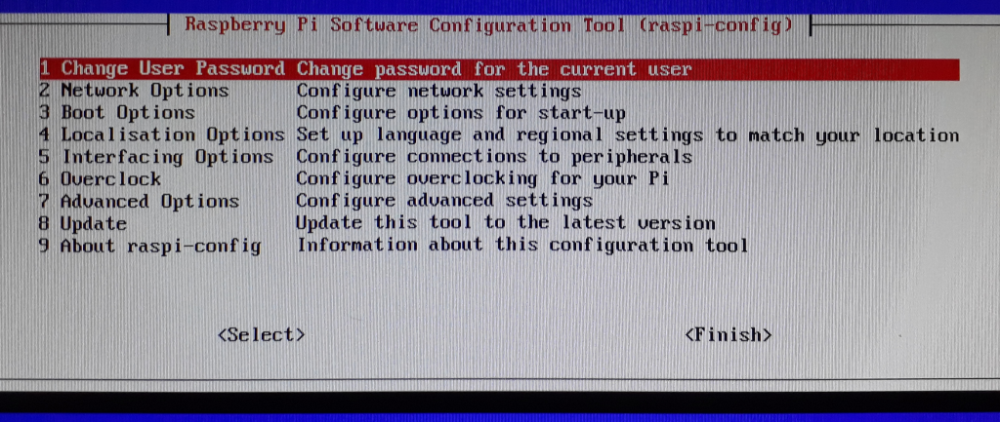

# Primeiras Configurações no Raspbian Lite – Parte 2 do Projeto


Após fazer a instalação do sistema operacional Raspbian Lite no Raspberry Pi 3 no artigo anterior, precisamos agora realizar algumas configurações básicas, para que o sistema fique bem configurado e estável para o uso. Além disso, já vamos realizar algum gerenciamento de usuários, configurar o básico de rede, deixar o sistema acessível via SSH e atualizar o sistema. Mãos ao teclado!

<!--more-->

# Nesta parte teremos:

* Login no sistema
* Configurações regionais do sistema (linguagem, layout de teclado, etc)
* Expansão da partição de sistema no cartão de memória
* Exclusão do usuário pi
* Criação de um novo usuário
* Configuração do serviço OpenSSH Server
* Configuração de conexão Wi-Fi ou via cabo
* Conectar-se ao Raspberry via SSH
* Atualização do sistema

O que será necessário:

* Monitor com entrada HDMI
* Teclado
* Rede LAN configurada para que o Raspberry ingresse nela, tornado-se possível acessá-lo via SSH a partir de outro computador na rede.

# 1. Login no sistema

Alguns segundos após iniciar o sistema pela primeira vez, nos deparamos com uma tela de login onde é pedido, obviamente, usuário e senha. Para ser sincero, na primeira vez que instalei e iniciei o sistema, por ter sido precipitado e não ter lido as documentações no site Raspberrypi.org, me perguntei: e agora? hahaha. Esta informação está nas documentações do Raspberrypi.org neste link a seguir: <https://www.raspberrypi.org/documentation/linux/usage/users.md>

Mas, para você que está acompanhando essa ótima série de artigos sobre o projeto, aqui está a informação:
> Usuário: pi
>
> Senha: raspberry


Como podemos observar, temos um nome de usuário e senha padrão bem forte no quesito segurança. Só que não!!!! Justamente por esse motivo, teremos um passo nesta parte do projeto explicando como excluir esse usuário padrão, já que a sua existência, na minha opinião, só é mais um pequeno risco à segurança de nosso sistema.

# 2. Configurações regionais do sistema

Para configurar localização e idioma do sistema, fuso-horário e layout de teclado, dê o comando:

```shell
sudo raspi-config
```
  

Aparecerá uma tela como a da imagem a seguir:


O intuito não é explicar detalhadamente as opções deste menu ou como se usa ele, pois não é foco do artigo dar explicações de nível mais iniciante. Porém, segue dicas de navegação para este menu:

- Setas do teclado para navegar dentre as opções
- Enter para confirmar uma opção / seleção
- Tab para alternar entre os sub-menus
- Espaço para marcar alguma opção do estilo checkbox

Para configurar as opções regionais, selecione a opção **4, Localisation Options**. Dentro deste menu, recomendo que sejam configuradas as opções **Locale, Timezone e Keyboard Layout**, de acordo com suas preferências.

Feitas estas configurações, não saia do menu do rasp-config ainda.

# 3. Expansão da partição de sistema no cartão de memória

Neste link <https://www.raspberrypi.org/documentation/configuration/raspi-config.md> é citado que se a instalação foi feita usando o NOOBS (método de instalação mais automático e fácil), então o sistema de arquivos foi expandido automaticamente quando o sistema foi iniciado pela primeira vez. Como não é o nosso caso, ou seja, utilizamos outro método para realizar a instalação, devemos nos certificar de que o sistema de arquivos seja expandido.

Mas afinal, o que é isso? Por que isso é necessário expandir o sistema de arquivos?

Como instalamos o sistema a partir de uma imagem pronta, apenas copiando-a (da maneira correta, claro) para o cartão de memória, ela ocupa um espaço inicial de aproximadamente 2GB no cartão, e o sistema de arquivos do diretório root (me refiro ao diretório / e não a pasta “home” do usuário root) que é EXT4, reconhece que está instalado em uma partição deste tamanho, somente. Logo, precisamos informar ao sistema de arquivos desta partição que ela tem mais espaço para trabalhar, já que o cartão de memória é maior que apenas 2GB. Isto pode ser feito através do menu raspi-config.

Após entrar no menu do raspi-config com `$sudo raspi-config`, selecione a opção **Advanced Options** e depois a opção **Expand Filesystem**. Quando terminar, dê finish e selecione yes para reiniciar o Raspberry. E pronto, seu sistema de arquivo agora reconhece todo o espaço disponível do sistemas de arquivos.

# 4. Configuração de uma senha para o usuário root

Vamos configurar uma senha para o usuário root. O motivo de fazer isso é porque ao longo do projeto serão feitas muitas tarefas administrativas e estar em uma sessão como root facilita o trabalho, desde que as ações sejam feitas com cuidado e que saibamos o que estamos fazendo.

Dê o seguinte comando:

```shell
sudo passwd root
<digite a nova senha>
```

Por fim, digite **su** e logue como root usando a senha que acabou de ser configurada.

Agora que está logado como root, observe que o símbolo que precede o que você digita é **\#** e não mais **\$**. Quando está **\#** significa que os comandos serão executados com os privilégios de root (administrador do sistema), enquanto **\$** significa que serão executados em privilégios do usuário em que está logado.

# 5. Exclusão do usuário pi

Antes de começar, certifique-se de fazer logout do usuário pi (caso tenha feito login com o mesmo) dando o comando exit. "Logue" com root neste momento.

O fato do usuário pi ser um usuário padrão do sistema Raspbian representa um risco à segurança do nosso sistema. Dois exemplos que justificam o risco à segurança:

  **1.** Se tivermos configurado o serviço SSH aberto para Internet para que possamos administrar nosso sistema à distância, um atacante, ao descobrir que por trás do SSH há um Raspberry (e sim, isso é possível), poderá refinar suas tentativas de login usando como nome de usuário o pi, pois sendo um Raspberry sabe que esse usuário existe ali. Isso diminui o nível de dificuldade de um ataque por força bruta. Sabendo o nome de usuário, um atacante só precisa trabalhar para descobrir a senha. Não sabendo o nome de usuário, precisa trabalhar para descobrir os dois. Por isso é importante especificarmos no arquivo de configuração do SSH somente os usuários que queremos que tenham acesso (veremos isto na seção de configuração SSH).

  **2.** Se por algum motivo um atacante ganha acesso ao nosso sistema, ele saberá que o usuário pi existe e ainda que está no grupo sudo, podendo executar comandos com privilégios de administrador.

Para excluir este usuário (pi) do sistema, dê o seguinte comando:

```Shell
deluser pi
```
 
Curiosidade: O comando `deluser` é uma espécie de alias (apelido/atalho) para o comando `userdel` já com os parâmetros que também removem a pasta home deste usuário. Portanto, certifique-se de fazer backup antes de utilizar `deluser`.


# 6. Criação de um novo usuário

Agora vamos criar um novo usuário. Sugiro que esse usuário tenha o seu nome ou um apelido. Algumas seções a frente, este usuário será usado para fazer login no serviço SSH.

Para exemplificar, escolhemos o nome **infra** para nosso usuário.

Dê o comando:

```Shell
adduser infra
```
 

Assim como o `deluser`, `adduser` também é uma espécie de front-end, mas para o comando `useradd`. `adduser` usa o comando useradd com os parâmetros que já criam uma senha e um diretório home para o usuário que está sendo criado.


Recomendo fortemente a configuração de uma senha forte, usando letras maiúsculas e minúsculas, números e caracteres especiais.

# 7. Configuração do serviço OpenSSH Server

Para podermos acessar o Raspberry remotamente, ou seja, de outro computador/sistema para dar comandos e etc, utilizaremos o famoso serviço de terminal remoto OpenSSH Server. Mais informações sobre este serviço em <https://www.openssh.com/>.

Por padrão o SSH server já vem instalado no sistema Raspbian, porém não é iniciado junto ao sistema, e muito provavelmente por motivos de segurança mesmo. Logo, nosso primeiro passo é habilitar este serviço para que seja inicializado durante o boot do sistema.

```Shell
systemctl enable ssh
```

Ao fazer isso, devemos obrigatoriamente configurar este serviço antes de reiniciar o sistema (ou iniciar esse serviço manualmente), pois suas configurações padrões não nos trarão muita segurança.

Para começar, recomendo fazer uma cópia do arquivo original de configuração para que possamos fazer alterações sem medo. Caso “dê ruim”, só restaurar o arquivo original e começar de novo. Faça isso com:
```Shell
cp /etc/ssh/sshd_config /etc/ssh/sshd_config.bak
```

O que vamos fazer no arquivo de configuração é simples e básico: dar permissão de acesso ao serviço somente para o usuário que criamos anteriormente, no meu caso “infra” e não permitir o login do “root”.

Acesse o arquivo de configuração /etc/ssh/sshd_config com o editor de texto de sua preferência. No meu caso foi utilizado o nano (nem sempre vamos pelo hard way, rsrs).

```Shell
nano /etc/ssh/sshd_config
```

Na seção “# Authentication” descomente a linha PermitRootLogin e altere seu valor de prohibit-password para no, ficando:

> PermitRootLogin no

E logo na linha a seguir, adicione:

> AllowUsers infra

Ficando:

> PermitRootLogin no
>
> AllowUsers infra

Se nesse momento já estiver curioso ou tiver necessidade de fazer configurações mais específicas neste serviço, recomendo a leitura do manual man sshd_config. Também, de maneira mais resumida, no próprio arquivo de configuração do SSH há várias descrições e explicações, além de exemplos de vários parâmetros que podem ser configurados em formato de comentário.

Com esses dois parâmetros básico evitamos que ataques de força bruta vindos da Internet acertem nosso usuário com facilidade. Como eu disse anteriormente em outra seção, aumentamos o nível de dificuldade de um ataque de força bruta pois estamos evitando que o atacante acerte o nome de usuário. Geralmente as tentativas desses ataques são direcionados a usuários e senha “manjados”, como “casa”, “home”, o óbvio “root” e senhas 1234 e semelhantes. Logo, com um nome de usuário não óbvio, uma senha forte e o serviço SSH minimamente configurado, temos uma certa margem de segurança para iniciar as próximas partes.

# 8. Configuração de conexão Wi-Fi ou via cabo

Feitas todas as tarefas das seções anteriores, chegou o momento de conectar o Raspberry na rede. Se você vai conectá-lo em sua rede via cabo, não há muito o que fazer, somente “espetar” o cabo ethernet mesmo, e então pular para a seção seguinte. Aliás, a configuração final do projeto será com o Raspberry conectado via cabo. Planeje-se para isso.

Mas, se neste momento você quer conectá-lo, ao menos temporariamente, via rede Wi-Fi para fazer a atualização do sistema e instalação dos pacotes/serviços que vamos utilizar, execute as tarefas a seguir.

Esta dica também é válida para quem quer aprender a se conectar a uma rede Wi-Fi via terminal Linux.

Confira o nome da interface Wi-Fi do Raspberry com o comando ip a, que é um alias (apelido, atalho) para o comando ip address. Provavelmente a interface Wi-Fi é wlan0. Se for outro nome, como exemplo, wlp2s0, basta usar este nome. Em um próximo artigo iremos abordar o assunto de nomenclaturas de interfaces de rede, configurando a maneira ideal para deixar um nome fixo para a interface.

Aqui seguiremos com wlan0. Agora, dê o seguinte comando:
```Shell
wpa_passphrase "nomeDaRedeWifi" "senhaDaRedeWifi" >> /etc/wpa_supplicant/wpa_supplicant.conf
```

Então, acesse o arquivo `/etc/wpa_supplicant/wpa_supplicant.conf` com o editor de textos de sua preferência. Observe que a senha da rede Wi-Fi está exposta no arquivo, porém como comentário. Pode apagar essa linha. Salve o arquivo e saia do editor.

 
A linha cheia de caracteres nesse arquivo é o hash da sua senha Wi-Fi
 

Agora, dê o comando:
```Shell
wpa_cli -i wlan0 reconfigure
```
Aparecerá um OK.

Neste momento, seu Raspberry já estará conectado a rede, mas se o sistema for reinicializado não se conectará automaticamente.

Então, para finalizar, devemos configurar o arquivo /etc/network/interfaces para que “leia” o arquivo que configuramos a rede Wi-Fi (`/etc/wpa_supplicant/wpa_supplicant.conf`) e assim saiba como se conectar automaticamente quando o sistema inicia.

Edite o arquivo `/etc/network/interfaces` com o editor de sua preferência. Vá para a última linha e acrescente:

>auto wlan0
>
>iface wlan0 inet dhcp
>
>wpa-conf /etc/wpa_supplicant/wpa_supplicant.conf

 
 
`auto wlan0` define que essa interface será “levantada” quando o comando `ifup -a` for usado, o qual inclusive é usado durante o processo de boot. `iface wlan0 inet dhcp` define que a interface wlan0 usa a família de endereços `inet`, parâmetro usado para redes TCP/IP; e `dhcp` define que o endereço IP será atribuído automaticamente via serviço DHCP.
Pode parecer não ideal configurar o arquivo interfaces tendo o serviço de dhcp client rodando, mas primordialmente o arquivo interfaces vem antes e é a maneira mais ideal de se configurar interfaces de rede no linux na minha opinião. Se visto os logs, o serviço DHCP pode apresentar “erros” por haver configuração manual no arquivo interfaces, mas na verdade é um “erro” somente porque ele diz não ser possível usar suas próprias configurações (do serviço DHCP) para aquela interface, já que ela está manualmente configurada no arquivo interfaces. Então, sem problemas.
 
 
 
Se você fez a configuração Wi-Fi do seu Raspberry e posteriormente irá utilizá-lo via cabo (a próxima parte deste projeto necessitará da conexão via cabo), acrescente também os parâmetros para a interface ethernet no arquivo interfaces, ficando:
> `auto eth0`
> 
> `iface eth0 inet dhcp`

Sem isso, ao conectar o cabo no Raspberry nada irá acontecer, pois a interface não foi instruída a receber endereço IP via DHCP.
 

# 9.  Conectar-se ao Raspberry via SSH

Terminadas as tarefas da seção anterior, recomendo a reinicialização do Raspberry. Para fazer isso via comando, dê:

```Shell
shutdown -r now
```

Aguarde o sistema iniciar, faça login (como usuário que foi criado ou mesmo como root) e verifique o endereço ip obtido pelo Raspberry com o comando ip a. Anote este endereço e então pode finalmente desconectar o teclado e o monitor do Rasp.

De qualquer computador com cliente SSH, seja Linux, Mac ou Windows (windows 10 possui cliente SSH nativo agora, https://tecnoblog.net/229971/windows-10-ativar-openssh-cliente/), vamos nos conectar ao Raspberry através do usuário que criamos seguindo a sintaxe:

```Shell
ssh userConfigurado@ip_do_Raspberry
```

No caso do exemplo desse artigo:

```Shell
ssh infra@ip_do_raspberry
```

# 10. Atualização do sistema

Finalmente a última seção desta parte. Já fizemos várias configurações iniciais e nosso sistema está utilizável. Devemos agora atualizá-lo, para que tudo fique em ordem.

Vale citar que, como atualizar o sistema é uma tarefa administrativa, após logar via SSH com o usuário que foi configurado, você deverá logar (mudar) como root. Basta dar o comando su e inserir a senha configurada para o usuário root.

Como root no sistema, dê:

```Shell
aptitude update
aptitude full-upgrade
```

 

O parâmetro full-upgrade atualiza os pacotes para as versões mais recentes e também remove pacotes antigos ou que não são mais necessários.


Terminamos! =D
