# Rodando o sistema do Raspberry Pi 3 em um HD Externo – Parte 4 do Projeto


Contextualização

Eis aqui uma parte opcional para o projeto, pois é possível manter o sistema rodando no cartão de memória como fizemos até agora.

Porém, como eu já citei no artigo de Instalação (link), o cartão de memória tem um ciclo limitado de quantidade de leituras e escritas, podendo deixar de funcionar caso o limite for atingido. Procure pesquisar melhor este assunto. Esse link <https://pt.stackoverflow.com/questions/8990/qual-é-a-vida-útil-de-um-cartão-sd-com-raspbian-raspberry-pi> pode ser um bom começo.

Outro ponto importantíssimo é a diferença de velocidade de leitura/escrita entre um cartão de memória e um HD Externo. Teremos uma seção neste artigo demonstrando essa grotesca diferença. Se esse for um ponto relevante para a sua decisão de migrar o Raspbian de um MicroSD para um HD Externo, dê uma espiada no resultado do teste de velocidade clicando aqui.

Visto que o cartão de memória possui uma certa limitação na quantidade de escritas e menor velocidade de leitura/escrita de dados, torna-se atrativo executar o sistema Raspbian, no qual trabalhamos até agora, em um HD Externo. Porém, isso não é tão simples/trivial de se fazer. Acompanhe o artigo.

# Nesta parte teremos:

* Como fazer um HD Externo funcionar no Raspberry
* Esquemas de particionamento nativo (MBR), GPT e partições LVM; e quais diretórios Linux montar em partições separadas.
* Como copiar o sistema que já foi instalado e configurado no cartão de memória para o HD Externo
* Criar uma imagem initramfs
* Comparação de velocidade de leitura/escrita entre cartão de memória e HD Externo

# O que será necessário:

* Um HD Externo compatível com USB 2.0
* (Opcional) Hub USB 2.0 de boa qualidade
* (Opcional) Materiais eletrônicos que serão descritos no artigo
* Para executar o sistema no HD Externo, requisito é criar initramfs

# 1. Como fazer um HD Externo funcionar no Raspberry

“Então não é só plugar o HD Externo no Raspberry Pi 3 e sair usando?” Pois é, meu caro, não! Parece complicado, mas depois de ter apanhado um pouco disso, dá para simplificar.

O sistema USB do Raspberry Pi 3 segue o padrão USB 2.0, e suas portas USB foram projetadas para serem utilizadas por dispositivos de baixa potência (Low-power device), que dentro do padrão 2.0 significa que esses dispositivos consomem até 100mA (miliampere). Ou seja, as portas USB do Raspberry Pi 3 fornecem até 100mA de energia para os dispositivos conectados. Exemplos de dispositivos de baixa potência são teclados e mouses. Já dispositivos de alta potência (High-power device), como um HD Externo, consome até o máximo estabelecido pelo padrão 2.0, que é 500mA, para que seja possível alimentar o rotor do disco e transferir dados a uma velocidade próxima do que o padrão 2.0 estabelece. Logo, ao olhar os números fica fácil entender porque o Raspberry Pi 3 não é capaz de “rodar” um HD Externo com excelência ou em sua máxima capacidade, pois o HD consome mais energia do que o Raspberry Pi 3 pode fornecer via porta USB. Simples!

Então, para um HD Externo funcionar corretamente no Raspberry Pi 3, precisamos fornecer a energia de qual ele necessita (via USB) através de uma fonte externa.

## Solução 1

Uma possível solução são os HUBs USB com fonte externa. Existem vários tipos, modelos e preços. Um exemplo é o da imagem a seguir:
")

Mas nessa solução há um grande problema/risco. A maioria desse tipo de produto no mercado acaba causando um perigoso efeito chamado de “BackPowering” (ou “BackPower”). A ideia correta de usar um HUB alimentado é de que os dispositivos conectados a ele recebam energia da fonte de alimentação externa, assim eliminando a necessidade do Raspberry ter que alimentar esse dispositivo. O problema é que essa alimentação que vem da fonte externa também acaba indo para a conexão USB entre o HUB e o Raspberry, e então acontece o efeito do Raspberry receber energia via porta USB, como se tivesse recebendo alimentação de forma contrária ao circuito. Para explicar melhor, usando o HUB da imagem acima, ao ligá-lo no Raspberry Pi 3 desligado, as luzes de energia do Pi piscavam. Na verdade, aparentemente o Raspberry Pi 3 até poderia ser alimentado dessa maneira, mas nessa configuração ignoramos a proteção de voltagem do Raspberry, e qualquer tipo de oscilação poderia danificar nosso Rasp. Para resolver isso, basta “cortamos” o positivo da conexão entre o Raspberry e o HUB USB. No meu caso, com o HUB da imagem acima, nada disso deu certo, pois  HUB era muito lento.

## Conclusão da solução 1

Pesquise por HUBs USB que não tenham o efeito de “backpowering” (retorno de energia). Existem e são mais caros. Particularmente eu não achei nenhum facilmente, apenas encontrei relatos de pessoas em alguns fóruns que compraram. Se o achar e o preço couber no seu orçamento, compre! Se não tiver essa proteção contra backpower, considere cortar o positivo do cabo que vai do hub até o Raspberry ou ainda modifique o circuito impedindo o positivo do hub de chegar até a entrada USB do Rasp. Um Link que pode ajudar a encontrar HUBs USB que funcionem para o Pi é o <https://elinux.org/RPi_Powered_USB_Hubs>.

## Solução 2

Aqui eu parti para a imaginação, e com as pouquíssimas habilidade adquiridas (e ainda lembradas) de um curso técnico em mecatrônica que fiz há 6 anos atrás, “projetei” uma adaptação técnica (vulgo gambiarra) que pode ser observada em duas imagens a seguir:

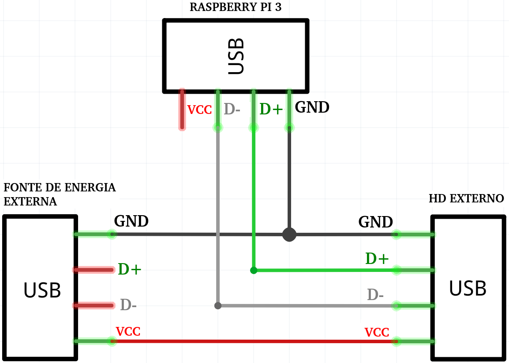


Eu comprei conectores USB fêmeas e cabos USB macho-macho. Protoboard e cabos conectores para o protoboard eu já tinha. 1 cabo macho-macho sai da fonte de alimentação externa (que também é a fonte do Raspberry, no meu caso) e se conecta em uma porta USB ligada ao protoboard. Essa porta USB terá como função “transferir” a sua energia para a outra porta ligada ao protoboard, onde está conectado o HD Externo. Como é possível observar na imagem Desenho do Esquema, somente os cabos vermelho e preto saem dessa primeira porta e se conectam com a porta do HD Externo, pois a função desses cabos é somente de  fornecer alimentação (vermelho = positivo; preto = comum). Agora que o HD tem a energia necessária para funcionar adequadamente, basta interligar os conectores do HD e do Raspberry que transmitem dados entre si. Então, da porta que está o HD Externo, interligam-se os conectores D+, D- e GND com a porta em que está ligada ao Raspberry Pi 3 (via cabo USB macho-macho). Dessa forma, o positivo da fonte externa não está indo para o Raspberry, não causando o backpower. Somente os conectores de transmissão de dados e o comum/negativo (que tem que ser o mesmo para todos) estão saindo do HD Externo e indo para o Raspberry.

Um problema enfrentado enquanto eu usava esse esquema no protoboard, foi o comprimento (total) dos cabos, e por esse motivo a comunicação entre HD Externo e Raspberry não funcionava. Todos os cabos tinham pouco mais de 1 metro. Quando consegui um cabo menor do HD Externo até a o protoboard, o problema já se resolveu. Eu consegui observar isso porque ao conectar o HD Externo direto no Rasp, ele funcionava normalmente, e quando conectava no protoboard (gambiarra), não funcionava. Claro que desconfiei da própria gambiarra e fiz vários testes. Mas no fim o problema era o comprimento dos cabos. Então, fica a dica para que use os menores cabos possíveis.

Visto que a gambiarra no protoboard tinha funcionado, resolvi montar o esquema em uma placa de fenolite, onde eu poderia soldar os conectores USB e também soldar um cabo USB cortado diretamente na placa, resolvendo o problema de comprimento. O resultado pode ser visto na imagem a seguir.


## Conclusão da solução 2

Se você tiver uma noção mínima de eletrônica e tempo, acredito que vale a pena investir na criação da sua própria solução. Trará aprendizado e satisfação. Use a imaginação.

Este link também explica sobre o backpower (retorno de energia, vamos dizer assim) fora do contexto com Raspberry e dá mais uma ideia de como evitar esse efeito. Vale à pena conferir. <https://ryan.com.br/blogs/quicktalk/2012/12/usar-hubs-usb-com-alimentacao-externa-pode-ser-perigoso-para-seu-aparelho/>

## Extra:

Acredito que usar um HD Externo somente para fazer backup e/ou algumas transferências de arquivos pontuais não necessite de um esquema com alimentação externa. Executei testes onde foi escrito e lido 1GB de dados no HD Externo sem alimentação extra, e os dados foram copiados com sucesso. Mas para o sistema inteiro rodar no HD Externo sem alimentação externa, não funciona. Ocorrem erros no kernel e o sistema fica instável.

## Extra 2:

Se o seu HD Externo é USB 3.0 com compatibilidade para USB 2.0, recomendo que utilize um desses cabos utilizados para carregar smartphones Samsung, por exemplo, que são MicroUSB em uma ponta e USB comum na outra. Usando o cabo USB 3.0 que já vem com o HD, tive problemas de compatibilidade com a minha plaquinha usada para alimentar o HD. Ao utilizar o cabo MicroUSB, não tive problemas. A diferença ao utilizar o HD dessa maneira é que não teremos a velocidade USB 3.0 disponível, a qual já não era utilizada de qualquer maneira.


# 2. Esquemas de particionamento nativo (MBR), GPT e partições LVM; e quais diretórios Linux montar em partições separadas.

Antes de tudo, é importante registrar que é possível iniciar o Raspbian a partir de uma unidade de armazenamento USB. Isso significa que poderíamos instalar o Raspbian em um Pen Drive ou HD Externo, conectá-lo ao Raspberry Pi 3 e iniciá-lo sem a necessidade de um cartão de memória. Porém, neste projeto não foi utilizada essa configuração, pois isso nos limita a utilizar o MBR como tabela de particionamento, além de que não conseguiríamos utilizar diferentes diretórios em outras partições. No projeto é utilizado somente o boot via cartão de memória (diretório boot e processo de boot), e o resto do sistema no HD Externo, permitindo que o HD tenha um esquema de particionamento GPT e também partições LVM, o que trás vantagens de gerenciamento e mais robustez.


Em meus experimentos, não fui capaz de iniciar o Raspbian em um HD com tabela de partições GPT ou com configuração híbrida MBR/GPT. Logo, concluo que ao utilizar o Raspberry Pi 3 para iniciar um sistema via USB, o HD Externo ou Pen Drive deverá manter o esquema original de quando se grava a imagem do sistema em disco, que é MBR.


Quando gravamos a imagem do sistema Raspbian em um cartão de memória (ou HD, Pen Drive), nativamente a imagem utiliza a tabela de partição do tipo MBR. Este esquema nos limita a utilizar somente 4 partições primárias ou 3 primárias e 1 do tipo estendida, o que permite a criação de várias outras lógicas. Porém, partições lógicas são encadeadas e a perda de uma delas pode desencadear na perda das subsequentes, além de que há uma boa discussão sobre essas partições terem um desempenho menor no quesito velocidade. Outra restrição do MBR é em relação ao tamanho do disco, não particionando mais do que 2TB.

Já a tabela de partição do tipo GPT (GUID Partition Table) pode ter até 128 partições primárias e trabalha com discos maiores que 2TB. Neste modelo as partições tem tamanho fixo e o redimensionamento é mais difícil.

Com LVM (Logical Volume Manager) é possível alocar espaço do HD em volumes lógicos, como se fosse um particionamento virtual, o que torna o gerenciamento do tamanho das partições mais fácil, podendo adicionar ou retirar espaço e utilizar até mais de um HD para 1 partição, por exemplo. O legal deste modelo é que podemos definir tamanhos menores e mais racionais para as partições, e somente expandi-los conforme for necessário. O projeto seguirá com partições LVM, mas abordaremos partições GPT também.

Em primeiro lugar, vou deixar definido o esquema de particionamento para o sistema Linux. Tenha esse esquema apenas como sugestão, considerando um HD de 1TB. Faça da maneira que achar melhor ou que for mais conveniente. Além disso, fique à vontade para discutir soluções de particionamento nos comentários.


Não se esqueça que a partição /boot já ficará separada no cartão de memória com o tamanho default da instalação.


|                |             | GPT                               |
| -------------- | ----------- | :-------------------------------- |
| **Patição Nº** | **Tamanho** | **Ponto de montagem / Diretório** |
| 1 | 80GB | / |
| 2 | 200GB | /home |
| 3 | 150GB | /usr |
| 4 | 68GB | /var |
| 5 | 2GB | /tmp |
| Total | 500GB |  |

|                |             | LVM                               |
| -------------- | ----------- | :-------------------------------- |
| **Patição Nº** | **Tamanho** | **Ponto de montagem / Diretório** |
| 1 | 20GB | / |
| 2 | 20GB | /home |
| 3 | 20GB | /usr |
| 4 | 20GB | /var |
| 5 | 1GB | /tmp |
| Total | 81GB |  |

Com a repartição sugerida para GPT, provavelmente não será necessário uma “manutenção” para gerenciar espaço por um bom tempo. E para LVM também, vai demorar para que seja necessário expandir alguma partição.

Agora vamos para os porquês dos diretórios escolhidos para ficarem em partições separadas.

Diretório **/home**: acredito que este não precise de muita explicação. Aqui são armazenados os arquivos, documentos, demais dados e configurações de um usuário. Além disso, na minha opinião é um bom diretório para armazenar scripts próprios e backup de arquivos de configurações ou até de outros diretórios inteiros.

Diretório **/usr**: armazena dados estáticos, que possam ser compartilhados e que estejam em modo de somente leitura. Contém vários subdiretórios. Para citar três deles temos `/usr/share/doc` que contém documentos sobre programas e comandos; `/usr/bin` que contém executáveis de uso geral mas que não são essenciais em caso de pane ou recuperação do sistema, como exemplo, firefox, git, find, curl, alsamixer; `/usr/local` é utilizado para a instalação de programas que não pertencem oficialmente a distribuição, e um exemplo pode ser o core, um emulador de redes de computadores.


Só para citar, o `/bin` é o diretório que contém executáveis de uso geral e que são essenciais em caso de pane ou recuperação do sistema, como exemplo, `ls`, `cp`, `dd`, `rm`…


Diretório **/var**: contém arquivos com conteúdo variável, como logs e spool de impressoras. Também para exemplificar, ao instalar o servidor web Apache no Raspbian, `/var/www` é o diretório que armazena a página web default do servidor.

Diretório **/tmp**: utilizado para gravar informações temporárias. Esse diretório tem seu conteúdo apagado a cada boot. Outro ponto importante para separar este diretório em uma partição própria é que por padrão qualquer usuário pode escrever nele. Antes de serem configuradas políticas de segurança para leitura e escrita nos diretórios, essa característica pode ser utilizada por algum programa mal intencionado ou por alguma invasão para preencher todo o espaço em disco disponível, e se o /tmp estiver no mesma partição do `/`, isso pode travar o sistema.

Diretório **/**: Aqui ficam todos os outros diretórios.


Os diretórios Linux seguem uma norma chamada Filesystem Hierarchy Standard (FHS). Portanto, se quiser estudar mais sobre os diretórios Linux, acesse o link http://www.pathname.com/fhs/


Finalmente colocaremos as mãos no teclado. Será descrito como realizar a configuração de particionamento GPT e de particionamento LVM. Escolha somente uma e siga os passos.

Os passos serão os seguintes para GPT:

* Apagar partições existentes no HD (esse passo apagará todos os dados do seu HD
* Criar nova tabela de partições GPT vazia
* Criar todas as partições conforme esquema que definimos anteriormente
* Formatar as partições com sistema de arquivos EXT4
* Copiar o sistema Raspbian do cartão de memória para o HD
* Realizar as devidas configurações para que tudo funcione
* Reiniciar para que o sistema inicie a partir do HD

Os passos serão os seguintes para LVM:

* Apagar partições existentes no HD (esse passo apagará todos os dados do seu HD
* Criar nova tabela de partições GPT vazia
* Criar uma partição de 100GB para ser o tamanho total do volume físico LVM
* Fazer a configuração LVM criando todas as partições lógicas
* Copiar o sistema Raspbian do cartão de memória para o HD
* Realizar as devidas configurações para que tudo funcione
* Reiniciar para que o sistema inicie a partir do HD

# 3. Passos para quem escolheu utilizar esquema GPT (partições primárias do tipo comum)


Se houver dados em seu HD e seguindo os passos a seguir, TODOS OS DADOS DO HDEXTERNO SERÃO PERDIDOS. Não se esqueça de realizar backup e ter um HD dedicadosomente para os propósitos do projeto.



Todos os passos abaixo deverão ser realizados com todas as partições do HD desmontadas.


Verifique qual dispositivo é o seu HD Externo no Raspbian com o comando fdisk -l ou lsblk, por exemplo. Em seguida, dê o comando gdisk /dev/seuDispositivo No meu caso, o HD Externo é o dispositivo /dev/sda. Então ficou:

```Shell    
gdisk /dev/sda
```

Caso o utilitário gdisk não esteja instalado, instale-o com:

```Shell
aptitude install gdisk
```

Prossiga digitando a letra d, para apagar todas as partições do HD Externo.

> Se houver mais de uma partição, será perguntado qual o número da partição desejaapagar, mas também é mostrado entre parênteses quantas partições há. Exemplo: seaparecer Partition number (1-3), significa que há 3 partições (`/dev/sda1`, `/devsda2`, `/dev/sda3`). Apague todas.

## 3.1. Criar nova tabela de partições GPT vazia

Depois, ainda dentro do `gdisk`, digite a letra `o` para criar uma tabela de partição GPT vazia. Se houver alguma pergunta de confirmação, confirme com `Y` e prossiga.

## 3.2. Criar todas as partições conforme esquema que definimos anteriormente

Agora vamos criar as partições que definimos anteriormente. Começaremos com a partição raíz, `/`. Digite `n` para criar uma nova partição. Em ***Partition number***, dê enter para escolher o número default, `1`. Em ***First sector*** também dê somente enter. Em ***Last sector*** vamos definir o tamanho que definimos, que é **80GB**. Então digite: `+80G` e dê enter. Em ***Hex code***, acredito que já estará definido o código `8300` se prosseguir somente com enter, código que indica que é uma partição do tipo Linux filesystem. Mas, para garantir, digite `8300` e dê enter.

Pronto, a primeira partição está criada. Basta seguir criando as outras seguindo os mesmos passos e definindo os tamanhos que definimos para cada uma anteriormente. A imagem a seguir mostra como ficou esse processo para mim.

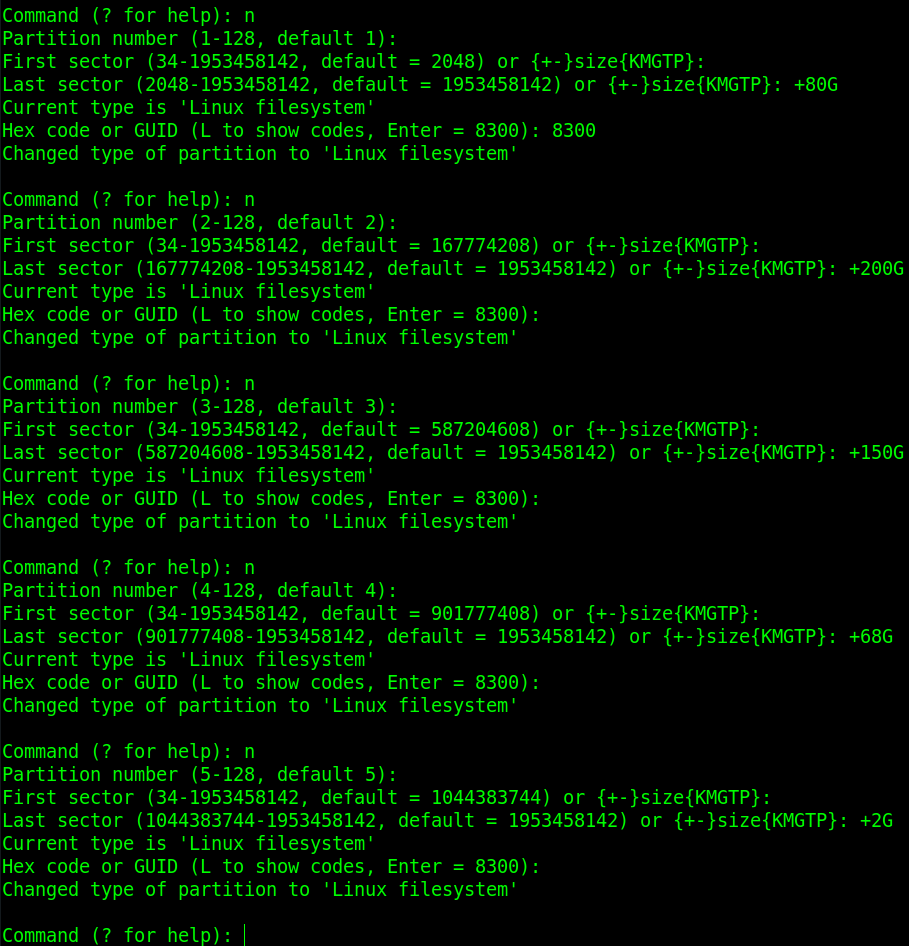

Por fim, ainda dentro do gdisk, digite `w` (e faça as confirmações necessárias) para escrever todas as mudanças em disco e sair.

Como pode ser observado na imagem a seguir, onde foi dado o comando `fdisk -l`, temos o HD com tabela de particionamento do tipo GPT e com as 5 partições que criamos com os tamanhos definidos.

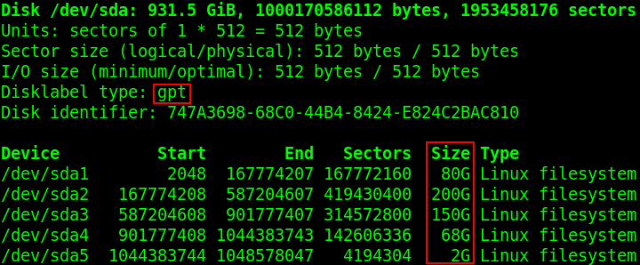

## 3.3. Formatar as partições com sistema de arquivos EXT4

Porém, as partições ainda não estão formatadas com o sistema de arquivos EXT4. Para formatar cada uma, seguem os comandos:

```Shell
mkfs.ext4 /dev/sda1
mkfs.ext4 /dev/sda2
mkfs.ext4 /dev/sda3
mkfs.ext4 /dev/sda4
mkfs.ext4 /dev/sda5
```

## 3.4. Copiar o sistema Raspbian do cartão de memória para o HD (esquema GPT)

Agora vamos copiar o sistema Raspbian do cartão de memória para o HD Externo e fazer as devidas configurações para que tudo funcione. Siga a sequência de passos a seguir.

Primeiro, vamos criar um diretório para cada partição dentro de /mnt:

```Shell
mkdir /mnt/raiz
mkdir /mnt/home
mkdir /mnt/usr
mkdir /mnt/var
mkdir /mnt/tmp
```

Agora, monte as devidas partições em seus respectivos diretórios:

```Shell
mount /dev/sda1 /mnt/raiz/
mount /dev/sda2 /mnt/home
mount /dev/sda3 /mnt/usr
mount /dev/sda4 /mnt/var
mount /dev/sda5 /mnt/tmp
```

Após esses comandos, ao dar um `lsblk` o resultado da montagem das partições do HD será como o da imagem a seguir:

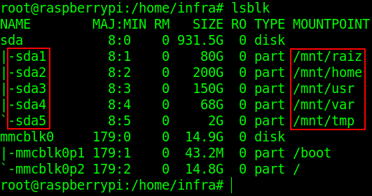

Com todas as partições montadas em seus devidos diretórios, resta fazer a cópia do sistema.

Para copiar do diretório `/` do cartão de memória todos os seus arquivos e subdiretórios para o HD, dê o comando:

```Shell
cp -ax / /mnt/raiz/
```

Onde, `-a` especifica que a estrutura original dos arquivos – atributos, permissões, links simbólicos, etc – devem ser preservadas, além de que faz a cópia recursiva, ou seja, copia diretórios. `-x` especifica que o `cp` deve operar somente no sistema de arquivos onde o comando foi executado. Se o `cp` tentar atravessar o limite para outro sistema de arquivos, esses arquivos serão ignorados. Isso inclui unidades de rede, outras partições, ou seja, qualquer arquivo que esteja em um ponto de montagem diferente. Só para exemplificar, nesse caso, o diretório `/boot` não será copiado para o HD, pois está montado em uma partição diferente de onde o comando `cp` foi executado. Mais precisamente, `/boot` está na partição `/dev/mmcblk0p1` do cartão de memória e o comando cp está na partição raiz do sistema, `/dev/mmcblk0p2`. Se houver curiosidade, dê um ls no diretório `/mnt/raiz/boot` após a cópia terminar. Não haverá nada nele.


Terminada a cópia do diretório raiz do cartão de memória para o HD Externo, devemos agora copiar os diretórios home, **usr** e **var** de `/mnt/raiz` para as partições que dedicamos exclusivamente para estes diretórios e que estão montadas em `/mnt/home`, `/mnt/usr` e `/mnt/var` respectivamente. Não é necessário copiar o diretório `/mnt/raiz/tmp` para `/mnt/tmp`, pois o conteúdo deste diretório é deletado a cada boot. Porém, foi importante montarmos este diretório mesmo assim, para nos lembrarmos posteriormente de apagar o conteúdo que está dentro do diretório raiz (`/mnt/raiz/tmp`). Para copiar os diretórios restantes para suas devidas partições dedicadas, dê:

```Shell
cp -ax /mnt/raiz/home/* /mnt/home/
cp -ax /mnt/raiz/usr/* /mnt/usr/
cp -ax /mnt/raiz/var/* /mnt/var/
```

Copiados todos os diretórios para suas devidas partições dedicadas, devemos apagar os conteúdos que estão nos diretórios `home`, `usr`, `var` e `tmp` dentro da partição `/dev/sda1`, que está montada em `/mnt/raiz`, porque quando iniciarmos o sistema a partir do HD perderemos acesso a eles, já que estes diretórios vão apontar para os conteúdos gravados em suas respectivas partições (sda2, sda3, sda4 e sda5). Para executar esta tarefa de deleção, dê:

```Shell
rm -rf /mnt/raiz/home/*
rm -rf /mnt/raiz/usr/*
rm -rf /mnt/raiz/var/*
rm -rf /mnt/raiz/tmp/*
```

## 3.5. Realizar as devidas configurações para que tudo funcione

Terminado o processo de cópia, falta apenas realizar algumas configurações para que o sistema no HD inicie corretamente. São dois passos, **1)** parametrizar o arquivo de boot `cmdline.txt` para especificar que a partição raiz do sistema está no HD e não no cartão de memória; e **2)** configurar os pontos de montagem das partições no arquivo `fstab`.

Comece dando o comando o `blkid`. Este comando retorna atributos de um dispositivo/partição. Utilizaremos o identificador `PARTUUID`, que é o padrão utilizado nesses arquivos que vamos configurar pelo Raspbian. Anote-os. **No meu caso**, são os destacados em negrito a seguir:

> /dev/sda1: UUID=”02bd4d94-883d-4b85-826b-7327ec03b236″ TYPE=”ext4″ PARTLABEL=”Linux filesystem” PARTUUID=”**f4a39e68-16b0-44c3-afd1-05dc0dea3973**”

> /dev/sda2: UUID=”cdd69d1f-5a85-4d04-9a74-af15870b2625″ TYPE=”ext4″ PARTLABEL=”Linux filesystem” PARTUUID=”**ab6f0c87-c856-40ab-8779-e7f0ab2414e8**”

> /dev/sda3: UUID=”d48b7f36-9915-4966-b0d0-360ba665fd41″ TYPE=”ext4″ PARTLABEL=”Linux filesystem” PARTUUID=”**7d48122f-0652-4540-933f-622cae2bfbab**”

> /dev/sda4: UUID=”e8c1e7d8-eb42-4872-8685-58b8ffae1f2f” TYPE=”ext4″ PARTLABEL=”Linux filesystem” PARTUUID=”**ff9f57af-edd0-4107-a108-363c1324ba7e**”

> /dev/sda5: UUID=”70fef83e-4197-4b17-9833-8c3980a81743″ TYPE=”ext4″ PARTLABEL=”Linux filesystem” PARTUUID=”**95588aa6-f7c3-4d09-a1b1-e2a4c8426f06**”



Não utilize os identificadores escritos aqui no artigo. São únicos e cada partição/dispositivo tem o seu. Use os códigos que lhe foram retornados quando o comando lsblk foi dado.


Antes de editarmos o primeiro arquivo, `/boot/cmdline.txt`, efetue uma cópia de backup do mesmo.

```Shell
cp /boot/cmdline.txt /boot/cmdline.txt.bak
```

Agora, edite o arquivo `/boot/cmdline.txt` com o editor de textos de sua preferência. No meu caso, o nano.

```Shell
nano /boot/cmdline.txt
```

Onde está `root=PARTUUID=algumaCoisa`, apague o **algumaCoisa** e escreva o valor do `PARTUUID` da sua partição **/dev/sda1**, partição raiz do HD. No meu caso, o resultado do arquivo `/boot/cmdline.txt` é:

```txt
dwc_otg.lpm_enable=0 console=serial0,115200 console=tty1 root=PARTUUID=f4a39e68-16b0-44c3-afd1-05dc0dea3973 initrd=0x01f00000 rootfstype=ext4 elevator=deadline fsck.repair=yes rootwait
```

Então, vamos editar o arquivo `fstab` armazenado no HD.

```Shell
nano /mnt/raiz/etc/fstab
```
Na linha que está `PARTUUID=algumaCoisa        /    ext4    (…)`, vamos substituir o **algumaCoisa** pelo `PARTUUID` da partição raiz do HD, **/dev/sda1**. Além disso, vamos acrescentar mais 4 linha abaixo desta que modificamos referentes as outras partições, que terão como ponto de montagem os diretórios **/home, /usr, /var, /tmp.** No meu caso (**apenas para exemplificar a estrutura, não copie, use seus valores**), meu arquivo fstab ficou:


A cada parâmetro deve ser dado um “tab” de espaço, e não um “space”


```txt
proc        /proc        proc        defaults      0        0
PARTUUID=e1ae1d9f-01        /boot        vfat      defaults        0        2
PARTUUID=f4a39e68-16b0-44c3-afd1-05dc0dea3973      /        ext4        defaults,noatime      0        1
PARTUUID=ab6f0c87-c856-40ab-8779-e7f0ab2414e8      /home        ext4        defaults        0        2
PARTUUID=7d48122f-0652-4540-933f-622cae2bfbab      /usr        ext4        defaults        0        2
PARTUUID=ff9f57af-edd0-4107-a108-363c1324ba7e      /var        ext4        defaults        0        2
PARTUUID=95588aa6-f7c3-4d09-a1b1-e2a4c8426f06      /tmp        ext4        defaults        0        

# a swapfile is not a swap partition, no line here
#   use dphys-swapfile swap[on|off]  for that
```

### INITRAMFS

Um requisito para que o sistema funcione em um HD Externo com alguns diretórios em diferentes partições, sejam partições GPT ou LVM, é a execução de uma imagem **initramfs**. Mas o que é uma imagem **initramfs**? De maneira resumida, antes da montagem do sistema de arquivos raiz e da execução do programa de inicialização do sistema (init), o Kernel precisa de módulos (drivers) para ser capaz de acessar o dispositivo em que o sistema de arquivos raiz está localizado. Em nosso caso, ao separar alguns diretórios do sistema em diferentes partições, torna-se necessário o pré-conhecimento de todas as partições para que seja possível montá-las. Logo, é justamente isso que o **initramfs** faz. Ele contém o mínimo exigido pelo kernel para reconhecer os dispositivos/partições e carregar o diretório raiz corretamente.

```Shell
mkinitramfs -o /boot/initramfs.gz
```

Para instruir o Raspberry a usar a imagem initram que criamos é preciso configurar os arquivos: `/boot/cmdline.txt` e `/boot/config.txt`. Os parâmetros configurados especificam o endereço de memória onde a imagem vai iniciar e também o nome do arquivo de imagem dentro de `/boot`. A seguir o resultado dos dois arquivos já configurados. Os parâmetros para configurar a imagem estão destacados em negrito:

**/boot/cmdline.txt**

> dwc_otg.lpm_enable=0 console=serial0,115200 console=tty1 root=/dev/mapper/raspberry-rootfs initrd=**0x01f00000** rootfstype=ext4 elevator=deadline fsck.mode=force fsck.repair=yes rootwait

**/boot/config.txt**

> #-- Acrescente a linha abaixo no final do arquivo --#
>
> **initramfs initramfs.gz 0x01f00000**

Sem essas configurações o Raspberry não será capaz de iniciar o sistema a partir do HD Externo.

3.6. Reiniciar para que o sistema inicie a partir do HD

**Terminamos** a parte para o esquema GPT. Agora é só reiniciar o Raspberry Pi 3 que o sistema rodará a partir do HD. Para demonstrar, reiniciei com `shutdown -r now`. A conexão SSH obviamente caiu. Aguardei alguns segundos (ao menos uns 20s) e tentei conectar via SSH no mesmo endereço IP que anteriormente. Obtive sucesso e fiz login. Em seguida, loguei como root. Dei o comando `lsblk`, e o resultado foi:

")


Pode ser que o endereço IP do sistema, ao reiniciar e iniciar pelo HD, mude. Verifique a tabela de clientes ativos em seu roteador. 



# 4. Passos para quem escolheu usar LVM (tabela de partições GPT + partições do tipo LVM)

Recapitulando os passos:

- Instalar o LVM no sistema
- Apagar partições existentes no HD (esse passo apagará todos os dados do seu HD)
- Criar nova tabela de partições GPT vazia
- Criar uma partição de 500GB para ser o tamanho tota- do volume físico LVM
- Fazer a configuração LVM criando todas as partições lógicas
- Copiar o sistema Raspbian do cartão de memória para o HD
- Realizar as devidas configurações para que tudo funcione
- Reiniciar para que o sistema inicie a partir do HD

## 4.1. Instalar o LVM no sistema

Já contextualizamos o LVM na seção de Esquemas de particionamento nativo (MBR), GPT e LVM; e quais diretórios Linux montar em partições separadas.

Agora, começamos a botar a mão no teclado instalando o LVM no sistema.

```Shell
aptitude install lvm2
```

## 4.2. Apagar partições existentes


Se houver dados em seu HD e seguindo os passos a seguir, TODOS OS DADOS DO HD EXTERNO SERÃO PERDIDOS. Não se esqueça de realizar backup e ter um HD dedicado somente para os propósitos do projeto. 



Todos os passos abaixo deverão ser realizados com todas as partições do HD desmontadas.


Verifique qual dispositivo é o seu HD Externo no Raspbian com o comando `fdisk -l` ou `lsblk`, por exemplo. Em seguida, dê o comando gdisk **/dev/seuDispositivo**. No meu caso, o HD Externo é o dispositivo **/dev/sda**. Então ficou:

```Shell
gdisk /dev/sda
```
Caso o utilitário `gdisk` não esteja instalado, instale-o com:

```Shell
aptitude install gdisk
```
Prossiga digitando a letra `d`, para apagar todas as partições do HD Externo.


Se houver mais de uma partição, será perguntado qual o número da partição deseja apagar, mas também é mostrado entre parênteses quantas partições há. Exemplo: se aparecer Partition number (1-3), significa que há 3 partições (/dev/sda1, /dev/sda2, /dev/sda3). Apague todas.


## 4.3. Criar nova tabela de partições GPT vazia

Depois, ainda dentro do `gdisk`, digite a letra (campo de cód) `o` para criar uma tabela de partição GPT vazia. Se houver alguma pergunta de confirmação, confirme com `Y` e prossiga.

## 4.4. Criar uma partição de 100GB para ser o tamanho total do volume físico LVM

Continuando ainda dentro do utilitário `gdisk`, digite a letra `n` para adicionar uma nova partição no HD. Em **Partition number**, dê enter para escolher o número default, `1`. Em **First sector** também dê somente enter. Em **Last sector** vamos definir o tamanho de **100GB**, suficiente para abrigar todas as partições que definimos para LVM na seção de particionamento. Então digite: `+100G` e dê enter. Em **Hex Code** or **GUID** não é necessário fazer alteração, então dê somente enter para seguir com a opção default 8300, código que indica que é uma partição do tipo Linux filesystem.


esse Hex Code é uma configuração opcional para a partição, que dá a ela um Label (rótulo). Caso queira dar um rótulo mais coerente com o que estamos configurando, digite **“8e00”**, que é o código para o Label “Linux LVM”. No meu caso, segui com a opção **8300** mesmo, **Linux filesystem**, para exemplificar que isso não terá efeito negativo em nossas configurações.


Por fim, ainda dentro do gdisk, digite w (e faça as confirmações necessárias) para escrever todas as mudanças em disco e sair.

Como pode ser observado na imagem a seguir, onde foi dado o comando `fdisk -l`, temos o HD com tabela de particionamento do tipo GPT e com a partição que acabamos de criar. Observe que esta partição é a **/dev/sda1**. Usaremos essa informação no próximo passo.

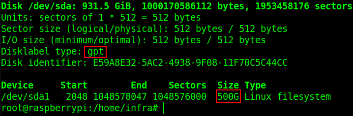
 

Não é necessário formatar a partição que criamos


## 4.5. Fazer a configuração LVM criando todas as partições lógicas

O particionamento LVM é formado por 3 elementos:

1. o **PV (Physical Volume/ Volume Físico)** – elemento que define a área (partição) física do HD que será utilizada como LVM;
2. **VG (Volume Group/ Grupo de Volumes)** – agrupa PV(Volumes Físicos). É essa subdivisão que receberá as partições lógicas (LG) do LVM dentro dela. Para fazer uma analogia, é semelhante a uma partição estendida do esquema de particionamento MBR;
3. **LG (Logical Group/ Grupo lógico)** – são as partições do LVM, as quais montamos e gravamos dados. Parafazer uma analogia, são como as partições lógicas do esquema de particionamento MBR.

Começaremos estabelecendo o Volume Físico (PV), ou seja, a área do HD que será utilizada como LVM. No passo anterior criamos uma partição de 100GB justamente para esse propósito. Então, para defini-la como um PV, faça:

```Shell
pvcreate /dev/sda1
```


no meu caso, ao dar o comando pvcreate fui informado de que havia uma assinatura ext4 naquela área do HD, pois anteriormente essa minha partição foi utilizada com o sistema de arquivos ext4. Então me foi solicitado uma confirmação para limpar essa assinatura. Bastou confirmar com y e prosseguir.


O próximo passo é criar um grupo de volumes (VG), estabelecendo um nome para ele (nomeei de raspberry; bem criativo) e já acrescentando o PV (Volume Físico) criado no passo anterior. Para isso:

```Shell
vgcreate raspberry /dev/sda1
```

Só para já dar um exemplo das possibilidades de manipulação do LVM, poderemos adicionar mais PVs (Volumes Físicos) a este VG (Grupo de Volumes) “raspberry” que criamos. Até o momento, temos um Grupo de Volumes com 100GB. Se for criada mais um PV, seja no mesmo HD ou até mesmo em outro(!!), basta adicioná-lo (com os comandos corretos, claro) a este VG que seu tamanho será aumentado, dando possibilidade das partições (LGs) serem redimensionadas ou mesmo que mais partições sejam criadas.


Agora vamos criar as LGs (Grupos Lógicos), ou seja, o que costumamos chamar de partições.

Como planejado, criaremos 5 partições, com tamanhos que também já foram definidos, para abrigar 5 diferentes diretórios do Linux, sendo eles: 1) diretório raíz (/), 2) diretório /home, 3) diretório /usr, 4) diretório /var e 5) diretório /tmp.

Para criar as partições, dê os comandos:
```Shell
lvcreate -L20G -n rootfs raspberry
lvcreate -L20G -n home raspberry
lvcreate -L20G -n usr raspberry
lvcreate -L20G -n var raspberry
lvcreate -L1G -n tmp raspberry
```

Onde, `-L20G` define um tamanho de 20 Gigabytes, `-n` o nome do Volume Lógico (partição) e `raspberry` é o LG (Grupo Lógico) onde a partição será criada.

Com os comandos pvs – exibe os PVs criados; vgs – exibe os VGs criados; lvs – exibe as partições; veremos o resultado de nossas configurações LVM.

```Shell
pvs
vgs
lvs
```

No meu caso, o retorno dos comandos anteriores pode ser visto na imagem a seguir.

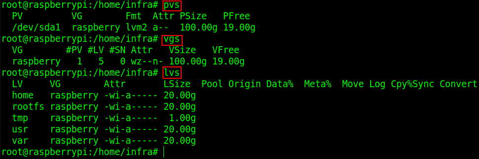

Agora, falta formatar as partições que acabamos de criar com o sistema de arquivos **ext4**. Antes de darmos os comandos de formatação, precisamos verificar como as partições foram reconhecidas pelo sistema. Para isso, dê:

```Shell
fdisk -l
```
Observe o retorno deste comando no meu caso, na imagem a seguir:

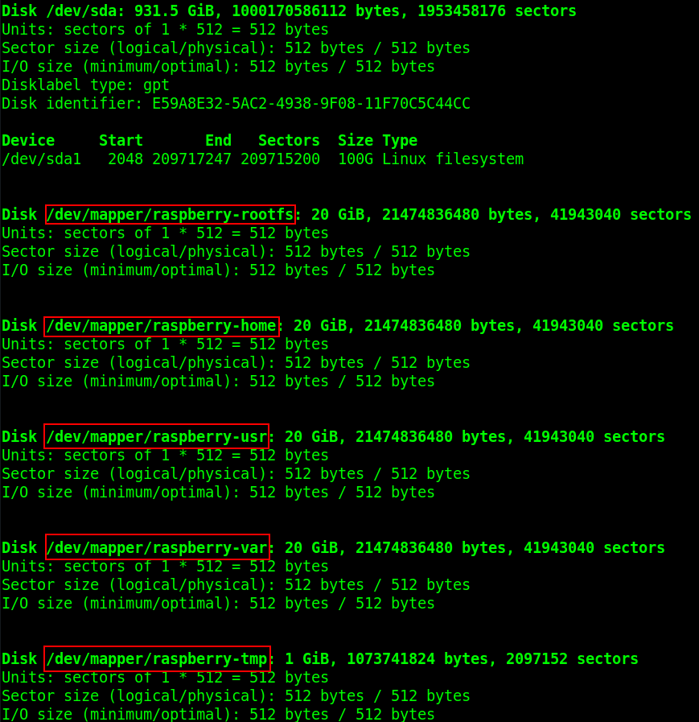

 Veja que as partições LVM são reconhecidas como **/dev/mapper/algumaCoisa**. Sabendo disso, podemos dar o comando de formatação das partições.

```Shell 
mkfs.ext4 /dev/mapper/raspberry-rootfs
mkfs.ext4 /dev/mapper/raspberry-home
mkfs.ext4 /dev/mapper/raspberry-usr
mkfs.ext4 /dev/mapper/raspberry-var
mkfs.ext4 /dev/mapper/raspberry-tmp
```

As configurações LVM estão concluídas e as partições (lógicas) estão formatadas. Basta fazer a cópia do sistema do cartão do memória para as partições LVM no HD.

## 4.6. Copiar o sistema Raspbian do cartão de memória para o HD (esquema LVM)

Agora vamos copiar o sistema Raspbian do cartão de memória para o HD Externo e fazer as devidas configurações para que tudo funcione. Siga a sequência de passos a seguir.

Primeiro, vamos criar um diretório para cada partição dentro de /mnt:

```Shell
mkdir /mnt/raiz
mkdir /mnt/home
mkdir /mnt/usr
mkdir /mnt/var
mkdir /mnt/tmp
```
Agora, monte as devidas partições em seus respectivos diretórios:

```Shell
mount /dev/mapper/raspberry-rootfs /mnt/raiz/
mount /dev/mapper/raspberry-home /mnt/home
mount /dev/mapper/raspberry-usr /mnt/usr
mount /dev/mapper/raspberry-var /mnt/var
mount /dev/mapper/raspberry-tmp /mnt/tmp
```
Após esses comandos, ao dar um `lsblk` o resultado da montagem das partições do HD será como o da imagem a seguir:

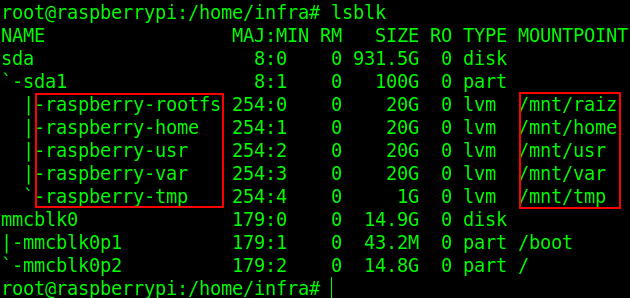

Com todas as partições montadas em seus devidos diretórios, resta iniciar a cópia do sistema.

Para copiar do diretório `/` do cartão de memória todos os seus arquivos e subdiretórios para o HD, dê o comando:

```Shell
cp -ax / /mnt/raiz/
```


onde, `-a` especifica que a estrutura original dos arquivos – atributos, permissões, links simbólicos, etc – devem ser preservadas, além de que faz a cópia recursiva, ou seja, copia diretórios. `-x` especifica que o cp deve operar somente no sistema de arquivos onde o comando foi executado. Se o `cp` tentar atravessar o limite para outro sistema de arquivos, esses arquivos serão ignorados. Isso inclui unidades de rede, outras partições, ou seja, qualquer arquivo que esteja em um ponto de montagem diferente. Só para exemplificar, nesse caso, o diretório `/boot` não será copiado para o HD, pois está montado em uma partição diferente de onde o comando cp foi executado. Mais precisamente, `/boot` está na partição `/dev/mmcblk0p1` do cartão de memória e o comando cp está na partição raiz do sistema, `/dev/mmcblk0p2`. Se houver curiosidade, dê um `ls` no diretório `/mnt/raiz/boot` após a cópia terminar. Não haverá nada nele.


Terminada a cópia do diretório raiz do cartão de memória para o HD Externo, devemos agora copiar os diretórios home, usr e var de `/mnt/raiz` para as partições que dedicamos exclusivamente para estes diretórios e que estão montadas em `/mnt/home`, `/mnt/usr` e `/mnt/var` respectivamente. Não é necessário copiar o diretório `/mnt/raiz/tmp` para `/mnt/tmp`, pois o conteúdo deste diretório é deletado a cada boot. Porém, foi importante montarmos este diretório mesmo assim, para nos lembrarmos posteriormente de apagar o conteúdo que está dentro do diretório raiz (`/mnt/raiz/tmp`). Para copiar os diretórios restantes para suas devidas partições dedicadas, dê:

```Shell
cp -ax /mnt/raiz/home/* /mnt/home/
cp -ax /mnt/raiz/usr/* /mnt/usr/
cp -ax /mnt/raiz/var/* /mnt/var/
```

Copiados todos os diretórios para suas devidas partições dedicadas, devemos apagar os conteúdos que estão nos diretórios home, usr, var e tmp dentro da partição /dev/sda1, que está montada em /mnt/raiz, porque quando iniciarmos o sistema a partir do HD perderemos acesso a eles, já que estes diretórios vão apontar para os conteúdos gravados em suas respectivas partições (sda2, sda3, sda4 e sda5). Para executar esta tarefa de deleção, dê:

```Shell
rm -rf /mnt/raiz/home/*
rm -rf /mnt/raiz/usr/*
rm -rf /mnt/raiz/var/*
rm -rf /mnt/raiz/tmp/*
```

## 4.7. Realizar as devidas configurações para que tudo funcione

Terminado o processo de cópia, falta apenas realizar algumas configurações para que o sistema no HD inicie corretamente. São dois passos, 1) **parametrizar o arquivo de boot cmdline.txt** para especificar que a partição raiz do sistema está no HD e não no cartão de memória; e 2) configurar os pontos de montagem das partições no arquivo **fstab**.

Se estivissemos configurando partições comuns, fosse GPT ou MBR, a melhor prática para configurá-las em arquivos de configuração como o **fstab** seria identificá-las através de identificadores de dispositivos/partições, UUID ou PARTUUID (esse último sendo padrão do Raspbian). Porém, no LVM isso muda, pois essas partições são lógicas e dependem dos módulos (drivers) e dos programas do LVM para funcionarem e isso pode influenciar na maneira em que são reconhecidas pelo sistema operacional. Logo, ao pesquisar um pouco sobre o assunto verifiquei que a melhor prática para configurar a montagem de partições LVM, em arquivos de configuração, é usando os identificadores **/dev/mapper/volumeGroup-logicalVolume**. Os comandos `fdisk -l`, já usado anteriormente, e o `blkid` são comandos que retornam esses caminhos/identificadores completos das partições LVM. Sabendo disso, seguiremos a parametrização dos arquivos de configuração com a melhor prática.

Antes de editarmos o primeiro arquivo, `/boot/cmdline.txt`, efetue uma cópia de backup do mesmo.

```Shell
cp /boot/cmdline.txt /boot/cmdline.txt.bak
```

Agora, edite o arquivo `/boot/cmdline.txt` com o editor de textos de sua preferência. No meu caso, o nano.

```Shell
nano /boot/cmdline.txt
```

Onde está **root=PARTUUID=algumaCoisa**, apague o **PARTUUID=algumaCoisa** e escreva o caminho/identificador da partição LVM raiz. O resultado do arquivo `/boot/cmdline.txt` é:

```cmdline.txt
dwc_otg.lpm_enable=0 console=serial0,115200 console=tty1 root=/dev/mapper/raspberry-rootfs initrd=0x01f00000 rootfstype=ext4 elevator=deadline fsck.repair=yes rootwait
```

Então, vamos editar o arquivo fstab armazenado no HD.

```Shell
nano /mnt/raiz/etc/fstab
```

Neste arquivo nós configuramos os pontos de montagem de partições. É aqui que especificamos que os diretórios **home, usr, var e tmp** terão suas próprias partições ao invés de ficarem juntas na mesma partição do **/** (raiz).

Comece apagando a linha `PARTUUID=e1ae1d9f-02`  / ...

No lugar dessa linha que apagamos, especificaremos a configuração da partição e diretório raiz, ficando:

```fstab.txt
/dev/mapper/raspberry-rootfs        /        ext4        defaults,noatime        0        1
```

Em seguida, na linha abaixo dessa que configuramos, especificaremos todas as outras partições e diretórios. A seguir, o resultado do arquivo `fstab` todo configurado:


A cada parâmetro deve ser dado um “tab” de espaço, e não um “space”


```fstab.txt
proc        /proc        proc        defaults        0        0
PARTUUID=e1ae1d9f-01        /boot        vfat        defaults        0        2
/dev/mapper/raspberry-rootfs        /        ext4        defaults,noatime        0        1
/dev/mapper/raspberry-home        /home        ext4        defaults,noatime        0        2
/dev/mapper/raspberry-usr        /usr        ext4        defaults,noatime        0        2
/dev/mapper/raspberry-var        /var        ext4        defaults,noatime        0        2
/dev/mapper/raspberry-tmp        /tmp        ext4        defaults,noatime        0        2
# a swapfile is not a swap partition, no line here
#   use dphys-swapfile swap[on|off]  for that
```

### INITRAMFS

Um requisito para que o sistema funcione em um HD Externo com alguns diretórios em diferentes partições, sejam partições GPT ou LVM, é a execução de uma imagem **initramfs**. Mas o que é uma imagem **initramfs**? De maneira resumida, antes da montagem do sistema de arquivos raiz e da execução do programa de inicialização do sistema (init), o Kernel precisa de módulos (drivers) para ser capaz de acessar o dispositivo em que o sistema de arquivos raiz está localizado. Em nosso caso, ao separar alguns diretórios do sistema em diferentes partições, torna-se necessário o pré-conhecimento de todas as partições para que seja possível montá-las. Logo, é justamente isso que o **initramfs** faz. Ele contém o mínimo exigido pelo kernel para reconhecer os dispositivos/partições e carregar o diretório raiz corretamente.

```Shell
mkinitramfs -o /boot/initramfs.gz
```

Para instruir o Raspberry a usar a imagem initram que criamos é preciso configurar os arquivos: `/boot/cmdline.txt` e `/boot/config.txt`. Os parâmetros configurados especificam o endereço de memória onde a imagem vai iniciar e também o nome do arquivo de imagem dentro de `/boot`. A seguir o resultado dos dois arquivos já configurados. Os parâmetros para configurar a imagem estão destacados em negrito:

**/boot/cmdline.txt**

```cmdline.txt
dwc_otg.lpm_enable=0 console=serial0,115200 console=tty1 root=/dev/mapper/raspberry-rootfs initrd=0x01f00000 rootfstype=ext4 elevator=deadline fsck.mode=force fsck.repair=yes rootwait
```

**/boot/config.txt**

```config.txt
#-- Acrescente a linha abaixo no final do arquivo --#
initramfs initramfs.gz 0x01f00000
```

Sem essas configurações o Raspberry não será capaz de iniciar o sistema a partir do HD Externo.

## 4.8. Reiniciar para que o sistema inicie a partir do HD

**Terminamos**. Agora é só reiniciar o Raspberry Pi 3 que o sistema rodará a partir do HD. Para demonstrar, reiniciei com `shutdown -r now`. A conexão SSH obviamente caiu. Aguardei alguns segundos (ao menos uns 20s) e tentei conectar via SSH no mesmo endereço IP que anteriormente. Obtive sucesso e fiz login. Em seguida, loguei como root. Dei o comando `lsblk`, e o resultado foi:

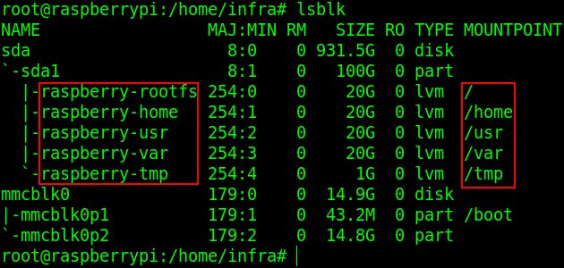


Pode ser que o endereço IP do sistema, ao reiniciar e iniciar pelo HD, mude. Verifique a tabela de clientes ativos em seu roteador.


# 5. Comparação de velocidade de leitura/escrita entre cartão de memória MicroSD e HD Externo

Todo esse trabalho para fazer o Raspberry rodar seu sistema operacional a partir do HD Externo deve ter alguma justificativa muito, muito boa! E sim, tem mesmo. Além de sanar o problema da limitada vida útil de um cartão de memória, rodar o sistema operacional Raspbian em um HD Externo é muito mais rápido. Sem mais delongas, vou deixar as imagens falarem por si só.

**Método de escrita:**

```Shell
dd bs=1M count=1024 if=/dev/zero of=testrw conv=fdatasync
```

Esse método de escrita no HD, segundo Roman Mamedov no link <https://romanrm.net/dd-benchmark>, diz ao `dd` para requisitar uma sincronização completa, apenas uma vez, logo antes do dd terminar sua tarefa. Ou seja, ao escrever todos os 1024MB de dados o `dd` pede ao sistema operacional: “agora certifique-se de que todos esses dados estejam no disco”. Somente após o sistema operacional retornar a informação de que os dados já estão no disco é que o dd para de medir o tempo total da operação e retorna o resultado das medições. Porque todo esse capricho? Se simplesmente solicitássemos uma operação de escrita com `dd` sem o parâmetro **conv=fdatasync** ficando `dd bs=1M count=1024 if=/dev/zero of=testrwo` sistema operacional só ia realmente escrever os dados em disco quando fosse conveniente a ele; e os resultados de medição do dd não seriam fieis, pois nesse caso os dados são armazenados no Buffer da RAM (write cache) e essa tarefa é bem rápida. Enfim, foi utilizado um método que testa de maneira mais fiel a tarefa de escrita em disco.

Método de leitura:

```Shell
echo 3 > /proc/sys/vm/drop_caches
dd if=testrw of=/dev/null bs=1M count=1024
```

O primeiro comando, `echo 3 > /proc/sys/vm/drop_caches`, limpa o **buffer-cache** existente, fazendo com que o sistema não aproveite para ler os dados diretamente dessa área de cache e sim do disco. Em seguida o comando de leitura com dd que foi escrito logo atrás.


Observação: vale citar que no momento do teste de leitura e escrita, o sistema operacional estava rodando no dispositivo sendo testado. Por exemplo: ao testar leitura e escrita no cartão de memória, o sistema operacional estava sendo executado nele no momento do teste. O mesmo vale para o HD Externo.



Utilizando esses métodos, na imagem a seguir temos o resultado da velocidade de escrita e leitura, respectivamente, do cartão MicroSD:

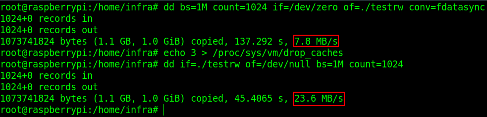

Utilizando os mesmo métodos, na imagem a seguir temos o resultado da velocidade de escrita e leitura, respectivamente, do HD Externo.

Primeiro o teste com as partições comuns da tabela de particionamento GPT:

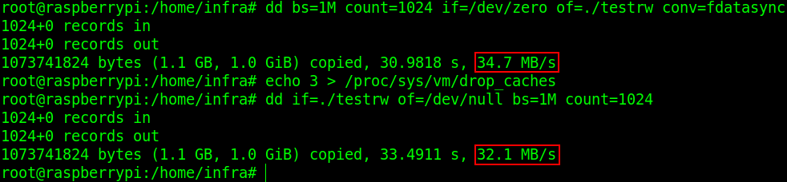

Para finalizar o teste com as partições do tipo LVM + tabela de particionamento GPT:

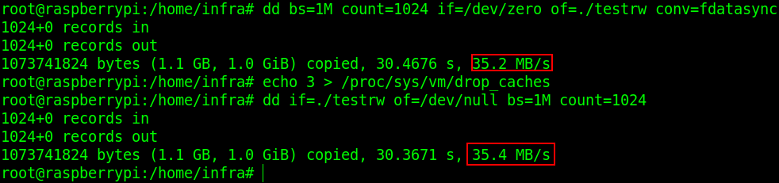

Me surpreendi ao ter uma velocidade ligeiramente mais rápida em partições LVM do que partições primárias comuns. Esse assunto é batante discutido e se ouve falar que o LVM tem uma influência ligeiramente negativa no desempenho. Nesse teste simples, não foi o caso.

# Done

Ufa! Finalmente terminamos toda essa parte de fazer um HD Externo funcionar no Raspberry Pi, de qual esquema de particionamento utilizar, quais diretórios Linux colocar em partições separadas e etc. Foi bastante conteúdo útil e que com certeza pode ser discutido, aprimorado, criticado, etc… Muitas variantes de configurações são possíveis, e na medida do possível, é legal discutir todas, assim teremos conteúdo para diversos casos. Sintam-se a vontadade nos comentários.


 

 


